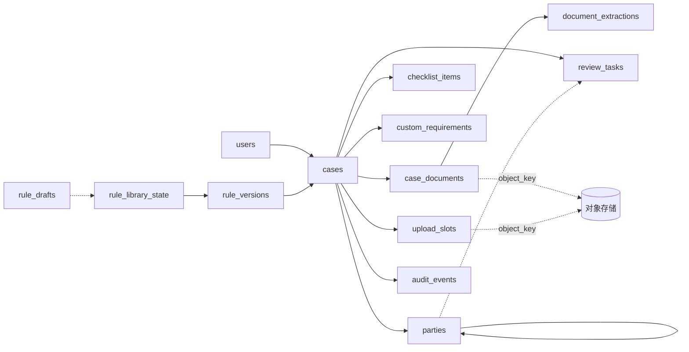

# 01 逻辑持久化模型

记录日期：2026-10-06

## 本文依赖

- `apps/web/lib/types.ts`：正式字段名与类型
- `apps/web/lib/data/actions.ts`：每个字段如何被写入
- `apps/web/lib/data/seed.ts`：示例数据形状
- `apps/web/lib/rules/library.ts`、`apps/web/lib/insights.ts`：清单如何由规则和覆盖拼出来
- `packages/domain/src/index.ts`：`Party`、`AccountProfile`、`AccountCase`
- `apps/api/prisma/schema.prisma`、`apps/api/src/app.ts`：只用来列出不能照搬的点
- `docs/production-readiness.md`：数据分级

## Agent 实现时禁止

- 不照抄 `apps/api/prisma/schema.prisma`。正式模型以 `apps/web/lib/types.ts` 和 `apps/web/lib/data/actions.ts` 为准。
- 不把股权树、清单状态、任务、文件元数据塞进案件行的 JSON 列。
- 不把文件字节、Base64 内容写进任何表。
- 不改变前端字段的名字、取值和可空性。需要的新字段以「扩展字段」形式加在响应里，并在本文登记。
- 不在本文之外另立一套实体命名。

本文只写逻辑模型和取舍。表、列、约束、索引的精确定义在 `docs/backend/02-postgres-schema.md`。

---

## 1. 逐类型落库方式

| 前端类型（`apps/web/lib/types.ts`） | 落库方式 | 表 / 列 |
| --- | --- | --- |
| `User` | 表 | `users` |
| `CaseRecord` | 表（主行） | `cases` |
| `Party`（`CaseRecord.parties`） | 表，邻接表 | `parties` |
| `ProfileDraft`（`CaseRecord.profile`） | `cases` 上的普通列 | `cases.province`、`tax_residency`、`features`、`trusted_contact`、`trusted_contact_name` |
| `ChecklistItemState`（`CaseRecord.checklist[requirementId]`） | 表 | `checklist_items`；`documentIds` 不存，读时由 `case_documents.requirement_id` 推出 |
| `CustomRequirement` | 表 | `custom_requirements` |
| `CaseDocument` | 表（元数据）+ 对象存储（字节） | `case_documents`；字节在 `LOCAL_STORAGE_ROOT` 或 S3 |
| 上传中的文件 | 表 | `upload_slots`（前端没有对应类型，见第 3.6 节） |
| 抽取结果（OCR 正文、字段、置信度、页码） | 表 | `document_extractions`、`extraction_pages`、`extraction_fields` |
| `ReviewTask` | 表 | `review_tasks` |
| `AuditEvent` | 表，只追加 | `audit_events`；`changes` 用 JSON 列 |
| `AuditChange` | `audit_events.changes` 里的 JSON 数组元素 | |
| `LibraryRule` | JSON 列（整组快照） | `rule_versions.extras`、`rule_drafts.extras` |
| `RuleTrigger` | `LibraryRule` 内的 JSON 对象 | |
| `BuiltinOverride` | JSON 列（按规则 id 的对象） | `rule_versions.overrides`、`rule_drafts.overrides` |
| `RuleDraft` | 表 | `rule_drafts`，同一时刻最多一行 `status = 'OPEN'` |
| `RuleLibraryState` | 由两张表拼出 | `rule_library_state`（单行：当前发布版本 + 乐观锁 version）+ `rule_versions`（全部已发布快照）+ 打开中的 `rule_drafts` |
| `Db.sessionUserId` | 不落库 | 由请求头或令牌决定，见 `docs/backend/04-authorization.md` |
| `CaseInsight`（`apps/web/lib/insights.ts`） | 不落库 | 每次读取时由 `fcc_api.rules.insight.analyze` 计算 |

### 为什么 `LibraryRule` 和 `BuiltinOverride` 用 JSON 列

- 它们总是整组读、整组写：一个版本的额外规则一起生效，一起发布。
- 已发布版本必须不可变。把整组规则存成一份快照，比多张子表加「不允许改」的约束简单可靠。
- `RuleTrigger` 是带可选字段的联合类型，按 `kind` 决定哪些字段有意义，JSON 加 Pydantic 校验最贴近前端形状。
- 规模很小（几十条），不需要按字段查询。

写入前必须用 Pydantic 模型完整校验，不允许存入未知字段。

### 为什么清单状态、任务、文件不用 JSON

- 合规队列、Document AI、仪表盘要跨案件筛选（未挂接的文件、正在抽取的文件、未完成任务），需要索引。
- 任务的 `partyId`、文件的 `requirementId` 需要和股权节点、清单项对应，单独成表才能加外键或校验。
- 并发写入时按行加锁更清楚，审计前后值也更容易算。

---

## 2. 股权树：用邻接表

`Party` 本来就是邻接表：每个节点有 `parentId`，根节点 `parentId = null`。数据库沿用同一结构，一个节点一行。

### 为什么不用整棵 JSON

| 考量 | 邻接表 `parties` | 整棵 JSON（Prisma 草稿的做法） |
| --- | --- | --- |
| 实体与人员页跨案件筛选 PEP、美国人士、自然人 | 普通索引即可 | 每次全表展开 JSON |
| 「同一案件只有一个根」 | 部分唯一索引，数据库保证 | 只能靠应用代码 |
| 根必须是实体、父节点必须存在 | `CHECK` + 复合外键 | 只能靠应用代码 |
| 任务 `partyId` 指向的节点被删除 | 外键 `ON DELETE SET NULL (party_id)` | 悬空引用 |
| 审计前后值 | 按节点比较 | 整棵对比 |
| 写入成本 | 每次保存要做增删改对比 | 一次覆盖 |

写入成本可以接受：前端每次 `updateParties` 发整组节点，服务端在同一事务里按 `id` 对比，插入新增的、更新变化的、删除消失的。**不能先全删再全插**，否则任务上的 `partyId` 会被外键置空。

### 如何保证一笔案件只有一个根

三层保证，缺一不可：

1. 数据库：`parties` 上建部分唯一索引 `UNIQUE (case_id) WHERE parent_id IS NULL`，保证最多一个根。
2. 数据库：`CHECK (parent_id IS NOT NULL OR kind = 'ENTITY')`，根只能是实体。
3. 服务端：`update_parties` 在提交前检查请求里恰好有一个 `parentId = null` 的节点，且它的 `id` 等于案件现有根节点的 `id`。不满足返回 400 `VALIDATION_FAILED`。这样即使前端误删根，也不会出现「零个根」。

另外服务端还要检查：

- 节点 `id` 在本案件内唯一，格式 `^[A-Za-z0-9_-]{1,64}$`。
- 每个非根节点的 `parentId` 指向同一请求里的某个节点，且那个节点 `kind = 'ENTITY'`（自然人下面不能挂人）。
- 沿 `parentId` 向上走不能成环。
- `ownershipPercent` 在 0 到 100 之间。

注意：持股合计不是 100%、实体没有拆到自然人，这些是 `validateOwnership` 的业务缺口，**允许保存**。它们只在送合规（`changeStatus` 到 `READY_FOR_COMPLIANCE`）和合规批准时作为门禁。

### 节点顺序必须保存

`personsToIdentify`、`generateRequirements` 的 `partyIds`、`validateOwnership` 的问题顺序都按 `parties` 数组顺序输出。`packages/domain/src/index.test.ts` 断言 `["bob", "dan", "erin"]` 依赖这个顺序。所以 `parties` 表要有 `position` 列，读出时按 `position` 排序，写入时按请求数组下标写入。

### 根节点的默认值

新建案件时根节点取 `actions.ts` `createCase` 的值：`kind = "ENTITY"`、`ownershipPercent = 100`、`isController = false`、`isSigningAuthority = false`、`isUsPerson = false`、`isPepHio = false`、`legalName` 与 `entityType` 与案件相同。Prisma/NestJS 草稿把根设为 `isController: true`，以前端为准。

---

## 3. 各实体说明

### 3.1 `User`

字段：`id`、`name`、`email`、`role`、`team`。另加 `active`（停用后不能登录，历史审计仍能显示名字）。

本期 `role` 存在库里。接 Entra 后，角色来自令牌里的组映射，`users.role` 作为最近一次登录时的缓存，用于显示。

### 3.2 `CaseRecord`

`CaseRecord` 继承 `AccountCase` 去掉 `profile` 后的字段：`id`、`version`、`legalName`、`entityType`、`status`、`parties`、`ruleVersion`、`createdAt`、`updatedAt`；再加 `reference`、`ownerId`、`jurisdiction`、`registrationNumber`、`profile`、`checklist`、`customRequirements`、`documents`、`tasks`、`dueDate`。

`cases` 表存标量字段。`parties`、`checklist`、`customRequirements`、`documents`、`tasks` 来自子表，读详情时组装。

新增列（不在前端类型里，响应里不返回或以扩展字段返回）：

| 列 | 用途 |
| --- | --- |
| `created_by` | 谁建的案件。顾问的可见范围用到它（见 04） |
| `submitted_at` | 最近一次进入 `READY_FOR_COMPLIANCE` 的时间。合规队列「等待时长」和排序用到它 |

`ruleVersion` 在建案时取 `rule_library_state.published_version`，之后不再改变。它是外键，指向 `rule_versions.version`。

### 3.3 `ProfileDraft`

与 `cases` 一对一，直接放在 `cases` 上：

| 前端字段 | 列 | 可空 | 默认 |
| --- | --- | --- | --- |
| `province` | `province` | 否 | `''` |
| `taxResidency` | `tax_residency` | 是 | `NULL` |
| `features` | `features`（文本数组） | 否 | `{}` |
| `trustedContact` | `trusted_contact` | 是 | `NULL` |
| `trustedContactName` | `trusted_contact_name` | 否 | `''` |

**前端与 domain 不一致，已选定前端为准：** domain 的 `AccountProfile` 要求 `taxResidency` 非空、`trustedContact` 为布尔，且没有 `trustedContactName`。前端用 `ProfileDraft` 允许「还没回答」（`null`）。库里存 `ProfileDraft`。计算清单时用 `fcc_api.rules.details.to_account_profile`，规则与 `apps/web/lib/insights.ts` 的 `toAccountProfile` 完全一致：`taxResidency` 为空时当作 `CANADA`，`trustedContact` 为空时当作 `false`。

### 3.4 `ChecklistItemState`

一行对应「某案件的某个清单项」：`case_id`、`requirement_id`、`status`、`updated_at`、`updated_by`。

- 只有被操作过的清单项才有行。没有行的清单项状态视为 `MISSING`，与 `actions.ts` 里 `record.checklist[requirementId]?.status ?? "MISSING"` 一致。
- `requirement_id` 不是外键。它可能是内置规则 id（`naaf`、`w9` 等）、额外规则 id（`rule_xxx`）或自定义清单项 id（`req_xxx`）。
- 停用或被新规则版本移除的清单项，已有行保留不删，只是不再出现在清单里。

**`documentIds` 不落库。** 前端同时维护 `ChecklistItemState.documentIds` 和 `CaseDocument.requirementId`，两边是冗余的。后端只保留 `case_documents.requirement_id` 一处，读取时按 `uploaded_at` 升序推出 `documentIds`。核对过 `seed.ts`，两边数据一致，迁移不丢信息。

### 3.5 `CustomRequirement`

字段：`id`、`name`、`createdBy`、`createdAt`。加 `case_id` 和 `position`（保持添加顺序）。在清单里显示为 `section = "Additional Requirements"`、`conditional = true`、`source = "Added by staff"`，与 `checklistFor` 一致。

### 3.6 `CaseDocument` 与上传

前端字段：`id`、`requirementId`、`fileName`、`sizeBytes`、`mimeType`、`uploadedBy`、`uploadedAt`、`extraction`。

新增列：

| 列 | 用途 | 响应里是否返回 |
| --- | --- | --- |
| `object_key` | 对象存储里的键，不含文件名 | 否 |
| `sha256` | 服务端计算的内容哈希 | 是，扩展字段 `sha256` |
| `storage_state` | `QUARANTINED` / `ACCEPTED` / `REJECTED` / `METADATA_ONLY` | 是，扩展字段 `storageState` |
| `scan_status` | `PENDING` / `CLEAN` / `INFECTED` / `ERROR` / `NOT_APPLICABLE` | 是，扩展字段 `scanStatus` |
| `detected_mime` | 按魔数识别的类型 | 否 |

`upload_slots` 存「已经发了上传地址、还没完成」的文件。前端的 `uploadDocuments` 在后端拆成三步（申请上传地址、传字节、完成登记），只有第三步改案件版本。细节见 `docs/backend/05-documents-and-files.md`。

种子文件只有元数据，没有字节，`storage_state = 'METADATA_ONLY'`、`scan_status = 'NOT_APPLICABLE'`、`object_key`、`sha256` 为空。这与前端现状一致（`docs/workbench-usage-and-design.md` 写明前端只记录文件名和大小）。

### 3.7 抽取结果

前端只有 `extraction` 一个状态值。后端另存抽取内容，供「解析设立文件」的原件对照（`apps/web/components/case/DocumentCompare.tsx`）和 Document AI 使用：

- `document_extractions`：一次抽取运行。状态、适配器、模型、开始与结束时间、错误码、页数。
- `extraction_pages`：每页 OCR 正文。
- `extraction_fields`：抽出的字段，含 `value`、`confidence`、`page_no`、`citation`。字段分组键 `group_key` 对应 `ExtractedParty.tempId`，`field_key` 对应 `legalName`、`title`、`ownershipPercent` 等。

`case_documents.extraction` 保存最近一次抽取的状态，是为了列表筛选不用连表。两处在同一事务里更新。

### 3.8 `ReviewTask`

字段：`id`、`title`、`partyId`、`requirementId`、`done`、`source`、`createdBy`、`createdAt`。加 `case_id`、`done_at`、`done_by`。

`party_id` 用复合外键指向 `parties (case_id, id)`，节点被删除时只把 `party_id` 置空（PostgreSQL 15 起支持 `ON DELETE SET NULL (party_id)`）。`requirement_id` 不加外键，理由同 3.4。

### 3.9 `AuditEvent`

前端字段：`id`、`caseId`、`actorId`、`action`、`summary`、`at`、`version`、`changes?`、`ai?: { model, accepted, ruleVersion }`。

落库列：`id`、`scope`、`case_id`、`actor_id`、`action`、`summary`、`at`、`version`、`changes`（JSON）、`ai_model`、`ai_accepted`、`ai_rule_version`，加 `rule_version`、`before_value`、`after_value`、`correlation_id`、`request_id`。

规则库事件在前端写成 `caseId: "rule-library"`、`version: 1`。后端存 `scope = 'RULE_LIBRARY'`、`case_id = NULL`，`version` 存规则库的新 `version`；接口输出时 `caseId` 仍写 `"rule-library"`，兼容审计页。细节见 `docs/backend/06-audit-and-concurrency.md`。

### 3.10 规则库：`LibraryRule`、`BuiltinOverride`、`RuleDraft`、`RuleLibraryState`

前端 `RuleLibraryState` 只保存「当前发布版本」的额外规则、停用列表和覆盖。发布新版本时旧版本的内容被覆盖。这会导致钉在旧发布版本上的案件清单变化，违反「后发布的规则不改写旧案件清单」。后端改为：

| 表 | 内容 |
| --- | --- |
| `rule_versions` | 每个已发布版本一行，`extras`、`disabled`、`overrides` 发布后不可修改。内置演示版 `demo-2026-10-04` 也是一行，三项为空 |
| `rule_drafts` | 草稿；打开中的草稿最多一行 |
| `rule_library_state` | 单行：`published_version`（新案件用哪个版本）、`version`（乐观锁） |

接口返回的 `RuleLibraryState` 由这三张表拼出，字段与前端相同：`publishedVersion`、`publishedExtras`、`publishedDisabled`、`publishedOverrides`、`draft`。规则版本语义见 `docs/backend/07-rules-versioning.md`。

---

## 4. Prisma / NestJS 草稿里不能照搬的点

逐条对照 `apps/api/prisma/schema.prisma` 和 `apps/api/src/app.ts`：

### `AccountCase`

1. `parties Json`：整棵股权树塞进 JSON。无法保证单根，无法跨案件查 PEP / 美国人士，任务无法引用节点。改为 `parties` 表。
2. `profile Json?`：存的是 domain `AccountProfile`，没有 `trustedContactName`，也不能表达「还没回答」。改为 `cases` 上的 `ProfileDraft` 列。
3. `checklist Json @default("{}")`，值是布尔（`Record<string, boolean>`）。前端是五态 `MISSING`、`REQUESTED`、`RECEIVED`、`VERIFIED`、`REJECTED`，并记录 `updatedAt`、`updatedBy`。改为 `checklist_items` 表。
4. 缺字段：`reference`、`ownerId`、`jurisdiction`、`registrationNumber`、`dueDate`、`submitted_at`。
5. `createdBy String` 只是字符串，没有用户表外键。
6. `entityType String`、`status String`：没有取值约束。
7. `ruleVersion String`：没有指向规则版本表，无法证明案件钉住的版本真实存在。
8. `id @default(cuid())`：与前端 `<前缀>_<随机串>` 和种子 ID 不一致。
9. 只有 `@@index([legalName])`，`reference` 没有唯一约束。
10. 没有自定义清单项、复核任务。

### `Document`

11. `requirementId String` 非空。前端允许 `null`（未归属文件，`seed.ts` 的 `d-3`）。
12. 字段名 `contentType`、`createdAt` 与前端 `mimeType`、`uploadedAt` 不同。以前端为准。
13. 没有 `extraction` 抽取状态，也没有抽取结果表。
14. `scanStatus String @default("PENDING")` 没有取值约束，没有隔离 / 已接受的存储状态。
15. `sha256` 由客户端在 DTO 里声明，服务端不验证。后端必须自己计算。
16. `objectKey` 由 `${id}/${uuid}-${fileName}` 拼成，文件名进了对象键。文件名可能含人名，属于机密信息，不应出现在键、日志和存储访问记录里。
17. `onDelete: Cascade`：删案件会删文件元数据，对象存储里的字节变成孤儿。

### `AuditEvent`

18. `onDelete: Cascade`：删案件会连带删除审计，违反只追加。改为禁止删除。
19. `accountId` 非空：规则库操作没有案件，无法记录。
20. `action String` 自由文本，且草稿实际写的是 `CASE_UPDATED`、`DOCUMENT_REGISTERED`，都不在前端 `AuditAction` 里。只允许 `AuditAction` 的 11 个值。
21. `before Json?`、`after Json?` 存整条案件记录：体积大，且没有 `summary`、`version`、`changes`、`ai`。改为前端 `AuditEvent` 字段，再加按动作计算的 `before_value` / `after_value`。

### 缺失的模型

22. 没有 `users`。
23. 没有规则库：`LibraryRule`、`BuiltinOverride`、`RuleDraft`、已发布版本快照都没有。
24. 没有上传中的状态（`upload_slots`）。

### `apps/api/src/app.ts` 里的行为

25. `AuthGuard` 在没有请求头时默认 `local-advisor`、角色 `Advisor`。新后端缺少身份头一律 401，角色值用大写 `ADVISOR`。
26. 没有任何角色判断。
27. 一个 `PATCH /cases/:id` 同时改名称、状态、股权、详情、清单。新后端每个 `actions.ts` 写入函数一个端点，每个端点一条明确的审计动作。
28. 状态允许客户端直接写 `READY_FOR_COMPLIANCE`，门禁只查了股权，没查账户详情、清单和未完成任务。
29. 上传地址指向 Azurite（`http://localhost:10000/devstoreaccount1`）。新后端本地用文件系统，生产用 S3。
30. 先 `findUnique` 比较版本、再 `updateMany`、再单独写审计，不在同一事务。新后端加锁、比较、写入、审计在同一事务。

---

## 5. 逻辑关系一览

完整 ER 图在 `docs/backend/02-postgres-schema.md` 第 1 节。
