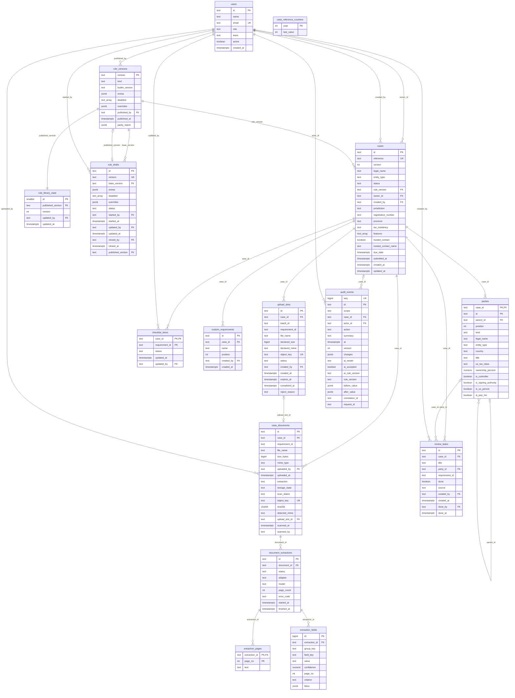

# 02 PostgreSQL 表结构

记录日期：2026-10-06

## 本文依赖

- `docs/backend/01-persistence-model.md`：每个前端类型落在哪张表、为什么
- `apps/web/lib/types.ts`、`packages/domain/src/index.ts`：枚举取值
- `apps/web/lib/data/seed.ts`、`apps/web/lib/rules/library.ts`：种子数据
- `apps/web/lib/labels.ts`：`PROVINCES` 省份代码
- `docs/production-readiness.md`：机密分级、只追加审计

## Agent 实现时禁止

- 不手写 SQL 改表，不用 `create_all()`。所有表、约束、索引、触发器、扩展都放在 `services/api/migrations/versions/` 的 Alembic 迁移里。
- 不改已合并的迁移文件；改结构就新建一个迁移。
- 不使用 PostgreSQL 原生 `ENUM` 类型。枚举一律用 `text` + `CHECK`，Python 侧用 `StrEnum`。理由：原生 ENUM 增删值要单独迁移且不能在事务里回滚，`CHECK` 改起来是普通迁移。
- 不建 `bytea` 列，不建存放文件内容或 Base64 的列。
- 不给 `audit_events` 建任何 `UPDATE`、`DELETE` 路径，不加 `ON DELETE CASCADE`。
- 不发明新的状态值、角色值、审计动作值。

---

## 1. ER 模型图

---

## 2. 枚举

所有枚举用 `text` + `CHECK (col IN (...))`。取值与来源文件完全一致。

| 枚举 | 取值 | 来源 | 用在 |
| --- | --- | --- | --- |
| Role | `ADVISOR`、`OPERATIONS`、`COMPLIANCE`、`ADMIN` | `types.ts` `Role` | `users.role` |
| EntityType | `corporation`、`charity`、`trust`、`ipp_rca`、`partnership`、`estate`、`condo`、`pooled_fund`、`association`、`first_nation` | domain `ENTITY_TYPES` | `cases.entity_type`、`parties.entity_type` |
| CaseStatus | `BUILDING`、`DOCS_REQUESTED`、`READY_FOR_COMPLIANCE`、`RETURNED`、`APPROVED` | domain `CaseStatus` | `cases.status` |
| TaxResidency | `CANADA`、`US`、`INTERNATIONAL`、`MIXED` | domain `TaxResidency` | `cases.tax_residency` |
| AccountFeature | `MARGIN`、`OPTIONS`、`COD_DVP`、`FPL` | domain `ACCOUNT_FEATURES` | `cases.features` 数组元素 |
| PartyKind | `ENTITY`、`PERSON` | domain `PartyKind` | `parties.kind` |
| UsTaxClass | `complex`、`simple`、`unsure` | domain `US_TAX_CLASSES` | `parties.us_tax_class` |
| Province | `AB`、`BC`、`MB`、`NB`、`NL`、`NS`、`NT`、`NU`、`ON`、`PE`、`QC`、`SK`、`YT`，或空串 | `labels.ts` `PROVINCES` | `cases.province` |
| DocStatus | `MISSING`、`REQUESTED`、`RECEIVED`、`VERIFIED`、`REJECTED` | `types.ts` `DocStatus` | `checklist_items.status` |
| ExtractionStatus | `NONE`、`PROCESSING`、`EXTRACTED`、`FAILED` | `types.ts` `ExtractionStatus` | `case_documents.extraction` |
| ExtractionRunStatus | `PROCESSING`、`EXTRACTED`、`FAILED` | 后端（`NONE` 表示没有运行，所以不出现） | `document_extractions.status` |
| StorageState | `QUARANTINED`、`ACCEPTED`、`REJECTED`、`METADATA_ONLY` | 后端，见 05 | `case_documents.storage_state` |
| ScanStatus | `PENDING`、`CLEAN`、`INFECTED`、`ERROR`、`NOT_APPLICABLE` | 后端，见 05 | `case_documents.scan_status` |
| UploadSlotStatus | `PENDING`、`COMPLETED`、`EXPIRED`、`REJECTED` | 后端，见 05 | `upload_slots.status` |
| TaskSource | `COMPLIANCE`、`AI`、`MANUAL` | `types.ts` `TaskSource` | `review_tasks.source` |
| AuditAction | `CASE_CREATED`、`OWNERSHIP_UPDATED`、`PROFILE_UPDATED`、`DOCUMENT_UPLOADED`、`CHECKLIST_UPDATED`、`REQUIREMENT_ADDED`、`STATUS_CHANGED`、`COMPLIANCE_DECISION`、`AI_SUGGESTION`、`TASK_UPDATED`、`RULE_LIBRARY` | `types.ts` `AuditAction` | `audit_events.action` |
| AuditScope | `CASE`、`RULE_LIBRARY` | 后端 | `audit_events.scope` |
| RuleVersionKind | `BUILTIN`、`PUBLISHED` | 后端，见 07 | `rule_versions.kind` |
| RuleDraftStatus | `OPEN`、`PUBLISHED`、`DISCARDED` | 后端，见 07 | `rule_drafts.status` |

---

## 3. 表定义

列格式：列名 · 类型 · 是否可空 · 默认 · 说明。没写「可空」的都是 `NOT NULL`。时间列一律 `timestamptz`。

### 3.1 `users`

| 列 | 类型 | 说明 |
| --- | --- | --- |
| `id` | text PK | 种子保留 `u-advisor` 等 |
| `name` | text | |
| `email` | text | 唯一，按 `lower(email)` 建唯一索引 |
| `role` | text | `CHECK` Role |
| `team` | text | |
| `active` | boolean，默认 `true` | |
| `created_at` | timestamptz，默认 `now()` | |

### 3.2 `rule_versions`

| 列 | 类型 | 说明 |
| --- | --- | --- |
| `version` | text PK | `demo-2026-10-04`，或 `published-YYYY-MM-DD`，同日重复发布加 `-2`、`-3` |
| `kind` | text | `CHECK` RuleVersionKind |
| `builtin_version` | text | 这一版使用哪套内置规则实现。本期都是 `demo-2026-10-04` |
| `extras` | jsonb，默认 `'[]'` | `LibraryRule[]`，只含 `enabled = true` 的规则 |
| `disabled` | text[]，默认 `'{}'` | 停用的内置规则 id |
| `overrides` | jsonb，默认 `'{}'` | `Record<ruleId, BuiltinOverride>` |
| `published_by` | text FK → `users.id`，可空 | `BUILTIN` 行为空 |
| `published_at` | timestamptz | |
| `parity_report` | jsonb，可空 | 发布前对拍与预览结果，见 07 |

约束：

- `CHECK (kind = 'PUBLISHED' OR (extras = '[]'::jsonb AND disabled = '{}' AND overrides = '{}'::jsonb))`：内置演示版不能带调整。
- `CHECK (kind = 'BUILTIN' OR published_by IS NOT NULL)`。
- 不可变：建 `BEFORE UPDATE OR DELETE` 触发器，抛异常。

### 3.3 `rule_library_state`

单行表。

| 列 | 类型 | 说明 |
| --- | --- | --- |
| `id` | smallint PK | `CHECK (id = 1)` |
| `published_version` | text FK → `rule_versions.version` | 新案件钉住的版本，即前端 `publishedVersion` |
| `version` | int，默认 `1` | 规则库乐观锁。`CHECK (version >= 1)` |
| `updated_by` | text FK → `users.id`，可空 | |
| `updated_at` | timestamptz | |

### 3.4 `rule_drafts`

| 列 | 类型 | 说明 |
| --- | --- | --- |
| `id` | text PK | `rdr_<随机>` |
| `version` | text | 唯一。`draft-YYYY-MM-DD`，同日重复加 `-2` |
| `base_version` | text FK → `rule_versions.version` | 从哪个已发布版本复制而来 |
| `extras` | jsonb，默认 `'[]'` | `LibraryRule[]`，含 `enabled = false` 的规则 |
| `disabled` | text[]，默认 `'{}'` | |
| `overrides` | jsonb，默认 `'{}'` | |
| `status` | text | `CHECK` RuleDraftStatus |
| `started_by` / `started_at` | text FK / timestamptz | |
| `updated_by` / `updated_at` | text FK / timestamptz | |
| `closed_by` / `closed_at` | 可空 | 发布或丢弃时写入 |
| `published_version` | text FK → `rule_versions.version`，可空 | 发布后指向生成的版本 |

约束：

- 部分唯一索引 `uq_rule_drafts_one_open ON rule_drafts ((true)) WHERE status = 'OPEN'`：同一时刻最多一份打开的草稿。
- `CHECK ((status = 'OPEN') = (closed_at IS NULL))`。
- `CHECK (status <> 'PUBLISHED' OR published_version IS NOT NULL)`。

### 3.5 `case_reference_counters`

| 列 | 类型 | 说明 |
| --- | --- | --- |
| `year` | int PK | 建案时的 UTC 年份 |
| `last_value` | int | `CHECK (last_value >= 0)` |

建案时 `SELECT ... FOR UPDATE` 该年份行（不存在则插入 0），加一后生成 `FCC-{year}-{last_value 左补零到 4 位}`。

**与前端的差异：** `actions.ts` 写死了 `FCC-2026-`，并用全表最大序号加一。后端按年份计数，跨年从 0001 重新开始，序号超过 9999 时自然变成 5 位。

### 3.6 `cases`

| 列 | 类型 | 说明 |
| --- | --- | --- |
| `id` | text PK | `case_<随机>`；种子保留 `case-0139` 等 |
| `reference` | text | 唯一。`CHECK (reference ~ '^FCC-[0-9]{4}-[0-9]{4,}$')` |
| `version` | int，默认 `1` | 乐观锁。`CHECK (version >= 1)` |
| `legal_name` | text | `CHECK (length(btrim(legal_name)) BETWEEN 1 AND 300)` |
| `entity_type` | text | `CHECK` EntityType |
| `status` | text，默认 `'BUILDING'` | `CHECK` CaseStatus |
| `rule_version` | text FK → `rule_versions.version` | 建案后不变。`ON DELETE RESTRICT` |
| `owner_id` | text FK → `users.id` | |
| `created_by` | text FK → `users.id` | |
| `jurisdiction` | text，默认 `''` | |
| `registration_number` | text，默认 `''` | 机密，不进日志 |
| `province` | text，默认 `''` | `CHECK (province = '' OR province IN (...13 个代码))` |
| `tax_residency` | text，可空 | `CHECK` TaxResidency |
| `features` | text[]，默认 `'{}'` | `CHECK (features <@ ARRAY['MARGIN','OPTIONS','COD_DVP','FPL']::text[])`；服务端保证无重复 |
| `trusted_contact` | boolean，可空 | |
| `trusted_contact_name` | text，默认 `''` | |
| `due_date` | timestamptz | 建案时 `now() + 10 天`，与 `createCase` 一致 |
| `submitted_at` | timestamptz，可空 | 最近一次进入 `READY_FOR_COMPLIANCE` 的时间 |
| `created_at` / `updated_at` | timestamptz | 每次写入更新 `updated_at` |

索引：

- `ix_cases_status_updated (status, updated_at DESC)`：案件列表、合规队列
- `ix_cases_owner (owner_id)`、`ix_cases_created_by (created_by)`：「分配给我」、顾问可见范围
- `ix_cases_entity_type (entity_type)`
- `ix_cases_rule_version (rule_version)`：规则库「钉在这个版本上的案件数」
- `ix_cases_search` GIN `gin_trgm_ops` on `lower(legal_name || ' ' || reference || ' ' || registration_number)`：列表搜索。迁移里先 `CREATE EXTENSION IF NOT EXISTS pg_trgm`

### 3.7 `parties`

| 列 | 类型 | 说明 |
| --- | --- | --- |
| `case_id` | text FK → `cases.id` | 复合主键之一 |
| `id` | text | 复合主键之一。前端生成，`CHECK (id ~ '^[A-Za-z0-9_-]{1,64}$')` |
| `parent_id` | text，可空 | 复合外键 `(case_id, parent_id) → parties (case_id, id)`，`DEFERRABLE INITIALLY DEFERRED` |
| `position` | int | 数组下标，从 0 开始。`UNIQUE (case_id, position) DEFERRABLE INITIALLY DEFERRED` |
| `kind` | text | `CHECK` PartyKind |
| `legal_name` | text | `CHECK (length(btrim(legal_name)) BETWEEN 1 AND 300)` |
| `entity_type` | text，可空 | `CHECK` EntityType |
| `country` | text，可空 | |
| `title` | text，可空 | |
| `us_tax_class` | text，可空 | `CHECK` UsTaxClass |
| `ownership_percent` | numeric(7,4) | `CHECK (ownership_percent BETWEEN 0 AND 100)` |
| `is_controller` / `is_signing_authority` / `is_us_person` / `is_pep_hio` | boolean，默认 `false` | |

约束：

- 主键 `(case_id, id)`
- `CHECK (parent_id IS NOT NULL OR kind = 'ENTITY')`：根只能是实体
- `CHECK (parent_id IS NULL OR parent_id <> id)`
- `CHECK (kind = 'ENTITY' OR (entity_type IS NULL AND us_tax_class IS NULL))`
- `CHECK (kind = 'PERSON' OR entity_type IS NOT NULL)`
- 部分唯一索引 `uq_parties_one_root ON parties (case_id) WHERE parent_id IS NULL`：一笔案件最多一个根。「至少一个根」由服务端在提交前检查，见 `docs/backend/01-persistence-model.md` 第 2 节

索引：

- `ix_parties_case_position (case_id, position)`
- `ix_parties_pep (case_id) WHERE is_pep_hio`、`ix_parties_us (case_id) WHERE is_us_person`：实体与人员页筛选
- `ix_parties_name` GIN `gin_trgm_ops` on `lower(legal_name)`：顶栏人名搜索、实体与人员搜索

`ownership_percent` 读出后转成 Python `float` 再交给规则函数，与 JavaScript 的 number 运算保持一致（容差 0.01 的比较在 `validate_ownership` 里）。

### 3.8 `checklist_items`

| 列 | 类型 | 说明 |
| --- | --- | --- |
| `case_id` | text FK → `cases.id` | 复合主键 |
| `requirement_id` | text | 复合主键。不加外键 |
| `status` | text | `CHECK` DocStatus |
| `updated_at` | timestamptz | |
| `updated_by` | text FK → `users.id` | |

索引：`ix_checklist_case_status (case_id, status)`。

### 3.9 `custom_requirements`

| 列 | 类型 | 说明 |
| --- | --- | --- |
| `id` | text PK | `req_<随机>` |
| `case_id` | text FK → `cases.id` | |
| `name` | text | `CHECK (length(btrim(name)) BETWEEN 1 AND 200)` |
| `position` | int | `UNIQUE (case_id, position)` |
| `created_by` | text FK → `users.id` | |
| `created_at` | timestamptz | |

### 3.10 `upload_slots`

| 列 | 类型 | 说明 |
| --- | --- | --- |
| `id` | text PK | `upl_<随机>` |
| `case_id` | text FK → `cases.id` | |
| `batch_id` | text | 同一次「选文件」的批次 |
| `requirement_id` | text，可空 | 上传时要挂的清单项；`null` 表示未归属 |
| `file_name` | text | `CHECK (length(file_name) BETWEEN 1 AND 255)` |
| `declared_size` | bigint | `CHECK (declared_size BETWEEN 1 AND 25000000)`，上限与 `UPLOAD_MAX_BYTES` 同步 |
| `declared_mime` | text | |
| `object_key` | text | 唯一 |
| `status` | text，默认 `'PENDING'` | `CHECK` UploadSlotStatus |
| `created_by` | text FK → `users.id` | |
| `created_at` / `expires_at` | timestamptz | |
| `completed_at` | timestamptz，可空 | |
| `reject_reason` | text，可空 | `SIZE_MISMATCH`、`TYPE_MISMATCH`、`INFECTED`、`MISSING_OBJECT` |

索引：`ix_upload_slots_case_batch (case_id, batch_id)`、`ix_upload_slots_pending (expires_at) WHERE status = 'PENDING'`。

### 3.11 `case_documents`

| 列 | 类型 | 说明 |
| --- | --- | --- |
| `id` | text PK | `doc_<随机>`；种子保留 `d-1` 等 |
| `case_id` | text FK → `cases.id` | |
| `requirement_id` | text，可空 | 一个文件最多挂一个清单项 |
| `file_name` | text | 机密，不进日志 |
| `size_bytes` | bigint | `CHECK (size_bytes >= 0)`；真实上传时是服务端测得的大小 |
| `mime_type` | text | 客户端声明并经魔数确认的类型 |
| `uploaded_by` | text FK → `users.id` | |
| `uploaded_at` | timestamptz | |
| `extraction` | text，默认 `'NONE'` | `CHECK` ExtractionStatus |
| `storage_state` | text | `CHECK` StorageState |
| `scan_status` | text | `CHECK` ScanStatus |
| `object_key` | text，可空 | 唯一 |
| `sha256` | char(64)，可空 | `CHECK (sha256 ~ '^[0-9a-f]{64}$')` |
| `detected_mime` | text，可空 | |
| `upload_slot_id` | text FK → `upload_slots.id`，可空 | 唯一 |
| `scanned_at` | timestamptz，可空 | |
| `scanned_by` | text，可空 | 扫描适配器名，如 `noop` |

约束：

- `CHECK ((storage_state = 'METADATA_ONLY') = (object_key IS NULL))`
- `CHECK (storage_state = 'METADATA_ONLY' OR sha256 IS NOT NULL)`
- `CHECK (storage_state <> 'ACCEPTED' OR scan_status = 'CLEAN')`

索引：

- `ix_documents_case_requirement (case_id, requirement_id)`
- `ix_documents_unassigned (case_id) WHERE requirement_id IS NULL`
- `ix_documents_extraction (extraction) WHERE extraction = 'PROCESSING'`
- `ix_documents_uploaded_at (uploaded_at DESC)`：Document AI 台账

### 3.12 `document_extractions`、`extraction_pages`、`extraction_fields`

`document_extractions`：

| 列 | 类型 | 说明 |
| --- | --- | --- |
| `id` | text PK | `ext_<随机>` |
| `document_id` | text FK → `case_documents.id` | |
| `status` | text | `CHECK` ExtractionRunStatus |
| `adapter` | text | `noop`、`seed`，后续为 OCR 供应商名 |
| `model` | text，可空 | 如 `doc-extract-demo` |
| `page_count` | int，可空 | |
| `error_code` | text，可空 | 只存代码，不存原文 |
| `started_at` | timestamptz | |
| `finished_at` | timestamptz，可空 | |

索引：`ix_extractions_document (document_id, started_at DESC)`。

`extraction_pages`：主键 `(extraction_id, page_no)`，`page_no >= 1`，`text` 为该页 OCR 正文。属于 Restricted 数据。

`extraction_fields`：

| 列 | 类型 | 说明 |
| --- | --- | --- |
| `id` | bigint identity PK | |
| `extraction_id` | text FK | |
| `group_key` | text | 一组字段描述同一个候选节点，对应 `ExtractedParty.tempId` |
| `field_key` | text | `kind`、`legalName`、`entityType`、`title`、`ownershipPercent`、`isController`、`isSigningAuthority`、`country` |
| `value` | text | 统一存字符串，读取时按 `field_key` 转型 |
| `confidence` | numeric(4,3) | `CHECK (confidence BETWEEN 0 AND 1)` |
| `page_no` | int，可空 | |
| `citation` | text，可空 | 如 `Shareholder_Register_2026.pdf · p.2, line 1` |
| `bbox` | jsonb，可空 | 预留：页内坐标 |

索引：`ix_extraction_fields_group (extraction_id, group_key)`。

### 3.13 `review_tasks`

| 列 | 类型 | 说明 |
| --- | --- | --- |
| `id` | text PK | `task_<随机>`；种子保留 `task-1` 等 |
| `case_id` | text FK → `cases.id` | |
| `title` | text | `CHECK (length(btrim(title)) BETWEEN 1 AND 500)` |
| `party_id` | text，可空 | 复合外键 `(case_id, party_id) → parties (case_id, id) ON DELETE SET NULL (party_id)` |
| `requirement_id` | text，可空 | 不加外键 |
| `done` | boolean，默认 `false` | |
| `source` | text | `CHECK` TaskSource |
| `created_by` | text FK → `users.id` | |
| `created_at` | timestamptz | |
| `done_by` | text FK → `users.id`，可空 | |
| `done_at` | timestamptz，可空 | |

索引：`ix_tasks_case (case_id, created_at)`、`ix_tasks_open (created_at) WHERE NOT done`。

### 3.14 `audit_events`

| 列 | 类型 | 说明 |
| --- | --- | --- |
| `seq` | bigint identity | 唯一。同一毫秒内的全序，用于排序和分页游标 |
| `id` | text PK | `evt_<随机>`；种子保留 `a-1` 等 |
| `scope` | text | `CHECK` AuditScope |
| `case_id` | text FK → `cases.id`，可空 | `ON DELETE RESTRICT` |
| `actor_id` | text FK → `users.id` | |
| `action` | text | `CHECK` AuditAction |
| `summary` | text | `CHECK (length(summary) BETWEEN 1 AND 500)` |
| `at` | timestamptz | |
| `version` | int | 案件事件：写入后的案件版本；规则库事件：写入后的规则库版本 |
| `changes` | jsonb，可空 | `AuditChange[]`：`[{ "field", "from", "to" }]` |
| `ai_model` / `ai_accepted` / `ai_rule_version` | 可空 | 对应前端 `ai` |
| `rule_version` | text，可空 | 案件事件写案件钉住的版本；规则库事件写发布后的版本或草稿版本 |
| `before_value` / `after_value` | jsonb，可空 | 服务端计算的前后值，见 06 |
| `correlation_id` | text | 前端请求头 `X-Correlation-Id`，没有则等于 `request_id` |
| `request_id` | text | 服务端生成 |

约束：

- `CHECK ((scope = 'CASE') = (case_id IS NOT NULL))`
- `CHECK ((scope = 'RULE_LIBRARY') = (action = 'RULE_LIBRARY'))`
- `CHECK ((ai_model IS NULL) = (ai_accepted IS NULL) AND (ai_model IS NULL) = (ai_rule_version IS NULL))`
- `CHECK (ai_model IS NULL OR action = 'AI_SUGGESTION')`
- `CHECK (version >= 1)`

只追加：

- 触发器 `audit_events_append_only`：`BEFORE UPDATE OR DELETE` 与 `BEFORE TRUNCATE` 一律 `RAISE EXCEPTION`。
- 生产库分两个角色：`fcc_migrator`（拥有表，Alembic 用）和 `fcc_app`（API 用）。`fcc_app` 对 `audit_events` 只有 `INSERT`、`SELECT`。本地可以只用 `fcc` 一个用户，但触发器照样生效。

索引：`ix_audit_case_seq (case_id, seq DESC)`、`ix_audit_actor_seq (actor_id, seq DESC)`、`ix_audit_action_seq (action, seq DESC)`、`ix_audit_seq (seq DESC)`。

---

## 4. 乐观锁字段

| 资源 | 版本列 | 被哪些写入加一 |
| --- | --- | --- |
| 案件 | `cases.version` | 除 `createCase` 外所有案件写入，包括只写审计的 `recordAiRejection` |
| 规则库 | `rule_library_state.version` | 七个规则库写入 |

上传槽申请、抽取状态变化、扫描状态变化不改 `cases.version`。理由见 `docs/backend/06-audit-and-concurrency.md`。

---

## 5. 迁移规则

- 只用 Alembic。`alembic revision --autogenerate -m "<说明>"` 生成后人工检查，再提交。
- 自动生成识别不了的内容要手写在迁移里：`pg_trgm` 扩展、部分唯一索引、`DEFERRABLE` 外键、`ON DELETE SET NULL (party_id)`、`CHECK`、触发器、授权语句。
- 每个迁移必须能 `downgrade`。审计表的 `downgrade` 只允许在 `APP_ENV` 为 `local` 或 `test` 时执行，否则抛异常。
- 第一个迁移 `0001_initial` 建全部表；第二个迁移 `0002_reference_data` 只插入内置规则版本 `demo-2026-10-04` 和 `rule_library_state` 单行（这两行是系统数据，所有环境都需要）。演示用户和演示案件不进迁移，由种子命令写入。

---

## 6. 种子数据（对应 `apps/web/lib/data/seed.ts`）

由 `python -m fcc_api.seed --reset` 写入，只允许 `APP_ENV` 为 `local` 或 `test`。`--reset` 的做法是 `DROP SCHEMA public CASCADE`、`CREATE SCHEMA public`、`alembic upgrade head`，再插入数据；不靠 `DELETE`，因为审计表禁止删除。

时间：`seed.ts` 以运行时的 `now` 为基准，按「几天前」「几小时前」计算。Python 种子同样以执行时刻为 `now`，换算规则一致：`HOUR = 3_600_000 ms`，`DAY = 24 * HOUR`，`t(h) = now - h 小时`。

### 6.1 系统数据（迁移 `0002_reference_data`）

- `rule_versions`：一行，`version = 'demo-2026-10-04'`、`kind = 'BUILTIN'`、`builtin_version = 'demo-2026-10-04'`、三项调整为空、`published_at = 迁移执行时间`。
- `rule_library_state`：`id = 1`、`published_version = 'demo-2026-10-04'`、`version = 1`。对应 `initialLibrary()`。
- `rule_drafts`：无。

### 6.2 用户（`USERS`）

5 行，原样写入 `id`、`name`、`email`、`role`、`team`：`u-advisor`（ADVISOR）、`u-ops`（OPERATIONS）、`u-compliance`（COMPLIANCE）、`u-admin`（ADMIN）、`u-advisor-2`（ADVISOR）。

### 6.3 案件

7 行，`rule_version` 都是 `demo-2026-10-04`，`version` 取 `seed.ts` 的值：

| id | reference | entity_type | status | version | owner_id / created_by | submitted_at |
| --- | --- | --- | --- | --- | --- | --- |
| `case-0139` | FCC-2026-0139 | corporation | DOCS_REQUESTED | 9 | u-advisor | 空 |
| `case-0142` | FCC-2026-0142 | charity | BUILDING | 4 | u-advisor | 空 |
| `case-0137` | FCC-2026-0137 | trust | READY_FOR_COMPLIANCE | 14 | u-advisor-2 | `t(20)`（审计 `a-9`） |
| `case-0131` | FCC-2026-0131 | condo | BUILDING | 1 | u-advisor | 空 |
| `case-0128` | FCC-2026-0128 | partnership | RETURNED | 17 | u-advisor-2 | 空 |
| `case-0119` | FCC-2026-0119 | first_nation | APPROVED | 21 | u-advisor | 空 |
| `case-0144` | FCC-2026-0144 | ipp_rca | BUILDING | 2 | u-advisor-2 | 空 |

`created_by` 取 `ownerId`（种子里所有 `CASE_CREATED` 审计的操作者都等于负责人）。`created_at`、`updated_at`、`due_date` 按 `createdDaysAgo`、`updatedHoursAgo`、`dueInDays` 计算。账户详情列取各案件 `profile(...)` 的值，未给出的字段取 `ProfileDraft` 默认值。

`case_reference_counters`：`(2026, 144)`。下一笔新案件是 `FCC-2026-0145`（如果执行年份是 2026）。

### 6.4 股权节点

共 24 行（与 `seed.ts` 里 `party()` 调用次数一致；按分项相加不是 25），按 `seed.ts` 数组顺序写 `position`。`party()` 的默认值要照搬：`ownershipPercent = 0`、四个布尔为 `false`，`kind = 'PERSON'` 且没给 `country` 时 `country = 'Canada'`，实体没给 `country` 时为空。

| 案件 | 节点数 | 根 |
| --- | --- | --- |
| case-0139 | 6 | `mr-root` |
| case-0142 | 4 | `nw-root` |
| case-0137 | 4 | `tf-root` |
| case-0131 | 1 | `lc-root` |
| case-0128 | 4 | `pr-root` |
| case-0119 | 3 | `er-root` |
| case-0144 | 2 | `od-root` |

### 6.5 文件

17 行：case-0139 的 `d-1`…`d-5`，case-0137 的 `t-1`…`t-5`，case-0128 的 `p-1`…`p-3`，case-0119 的 `e-1`…`e-4`。

- `file_name`、`size_bytes`、`requirement_id`、`uploaded_by`、`uploaded_at` 取 `seed.ts`。`d-3` 的 `requirement_id` 为空（未归属）。
- `mime_type = 'application/pdf'`、`extraction = 'EXTRACTED'`。
- `storage_state = 'METADATA_ONLY'`、`scan_status = 'NOT_APPLICABLE'`、`object_key`、`sha256` 为空。种子不生成任何文件字节。
- 每个文件一行 `document_extractions`：`status = 'EXTRACTED'`、`adapter = 'seed'`、`page_count = 0`，没有页和字段。

### 6.6 清单状态

23 行，由 `items(...)` 展开，`updated_at`、`updated_by` 取 `items()` 的参数：

- case-0139：9 行（`naaf` VERIFIED，`formation`、`resolution`、`margin` RECEIVED，`beneficial-owner`、`identity`、`pep`、`w9`、`rc519` REQUESTED），`t(5)`，`u-advisor`
- case-0137：5 行（`naaf`、`formation` VERIFIED，`beneficial-owner`、`identity`、`cod-dvp` RECEIVED），`t(22)`，`u-ops`
- case-0128：5 行（`naaf` VERIFIED，`formation` REJECTED，`w8` RECEIVED，`identity`、`beneficial-owner` REQUESTED），`t(28)`，`u-compliance`
- case-0119：4 行，全部 VERIFIED，`t(96)`，`u-compliance`

`documentIds` 不写入，由文件的 `requirement_id` 推出。已核对 `seed.ts` 中两边一致。

### 6.7 任务、自定义清单项

- `review_tasks`：case-0128 的 `task-1`（`party_id = pr-gp`）、`task-2`（`party_id = pr-root`）、`task-3`（`requirement_id = formation`），`source = COMPLIANCE`，`created_by = u-compliance`，`created_at = t(28)`。
- `custom_requirements`：无。

### 6.8 审计

14 行 `a-1`…`a-14`，字段原样写入。补齐后端列：`scope = 'CASE'`、`rule_version = 'demo-2026-10-04'`、`correlation_id = request_id = 'seed'`、`before_value`、`after_value` 为空。`a-2`、`a-14` 的 `ai_*` 三列取 `seed.ts` 的 `ai`。

按 `seed.ts` 数组的**倒序**插入（前端数组是最新在前），使 `seq` 递增方向与时间一致。

### 6.9 种子校验

种子命令结束前自检，任一项不符就失败并回滚：

- 7 笔案件，每笔恰好一个根节点。
- 每个文件的 `requirement_id` 与 `seed.ts` 对应清单项的 `documentIds` 一致。
- 对每笔案件运行 `analyze`，结果与 `docs/backend/10-test-catalog.md` 第 2 节「种子案件的期望清单」一致。

## 7. 上线追加

`0003_launch` 的表、列和 16 条 `PENDING` 批准记录见 `docs/backend/12-production-launch.md` 第 11 节。不要把这些列写进 `0001_initial`。第一期种子不插入 `APPROVED` 批准行。
