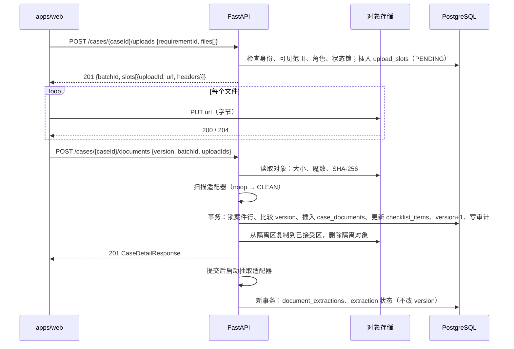

# 05 文件、上传与抽取

记录日期：2026-10-06

## 本文依赖

- `docs/production-readiness.md`：「Data classification」与「Integrations not yet implemented」，扫描、隔离、不可变容器、日志禁写内容
- `apps/web/lib/data/actions.ts`：`uploadDocuments`、`assignDocument`
- `apps/web/lib/types.ts`：`CaseDocument`、`ExtractionStatus`
- `apps/web/lib/ai/mock.ts`：`ExtractedParty`（`confidence`、`citation`）
- `apps/web/components/case/DocumentCompare.tsx`、`ParseDocumentsModal.tsx`：原件对照与页码
- `apps/web/app/(workspace)/document-ai/page.tsx`：文件台账
- `docs/backend/02-postgres-schema.md`：`case_documents`、`upload_slots`、`document_extractions` 等表
- `docs/backend/03-api-contract.md`：3.7、3.8、4.7、4.8、4.14 节

## Agent 实现时禁止

- 不把文件字节、Base64、OCR 原图写进 PostgreSQL。库里只存元数据、对象键、哈希、抽取出的文本与字段。
- 不信任客户端声明的大小、类型和哈希。大小、魔数、SHA-256 都由服务端读取对象后自己算。
- 不把文件名放进对象键。
- 不让 API 长期代理大文件下载（本地模式除外）。生产预览用短期预签名地址。
- 不在任何日志里写第 7 节列出的字段。
- 不实现真实的扫毒或 OCR。本期只写占位适配器。

---

## 1. 状态一览

一个文件有三条互相独立的状态线：

| 状态线 | 列 | 取值 | 谁改 |
| --- | --- | --- | --- |
| 存储 | `case_documents.storage_state` | `QUARANTINED` → `ACCEPTED` 或 `REJECTED`；种子为 `METADATA_ONLY` | 完成登记流程 |
| 扫描 | `case_documents.scan_status` | `PENDING` → `CLEAN` / `INFECTED` / `ERROR`；种子为 `NOT_APPLICABLE` | 扫描适配器 |
| 抽取 | `case_documents.extraction` | `NONE` → `PROCESSING` → `EXTRACTED` / `FAILED` | 抽取适配器 |

`extraction` 的四个值与前端 `ExtractionStatus` 相同，Document AI 页的「Reading / Extracted / Failed / Not processed」直接用它。

本期 `SCAN_ADAPTER=noop`，扫描在完成登记的同一请求里同步返回 `CLEAN`，所以登记成功的文件一定是 `ACCEPTED` + `CLEAN`。`QUARANTINED`、`PENDING` 状态的行本期不会持久化，但枚举和约束先建好，接入异步扫描时不用改表。

---

## 2. 上传流程

前端的 `uploadDocuments(record, requirementId, files)` 拆成三步。只有第三步改案件。



### 2.1 申请上传地址

`POST /api/v1/cases/{caseId}/uploads`，请求和响应见 `docs/backend/03-api-contract.md` 3.7 节。

服务端：

1. 校验身份、可见范围、角色、状态锁（同 `uploadDocuments`）。
2. 校验每个文件：`fileName` 1–255 字符，去掉路径部分；`sizeBytes` 1 到 `UPLOAD_MAX_BYTES`；`mimeType` 属于 `UPLOAD_ALLOWED_MIME`。
3. `requirementId` 非空时必须在当前清单里。
4. 每个文件生成 `upload_slots` 行：`status = PENDING`、`expires_at = now + UPLOAD_URL_TTL_SECONDS`、`object_key` 见第 3 节。
5. 为每个槽签发写入地址：
   - 本地：`{API 基址}/api/v1/local-storage/uploads/{uploadId}?expires={unix 秒}&sig={HMAC-SHA256(LOCAL_URL_SIGNING_SECRET, "PUT\n{uploadId}\n{expires}")}`
   - S3：对 `S3_BUCKET_QUARANTINE` 的 `object_key` 生成预签名 `PUT`，签入 `Content-Type` 和 `Content-Length`，要求 `x-amz-server-side-encryption: aws:kms` 与 `S3_KMS_KEY_ID`。

这一步不需要 `version`，不改案件，不写审计。过期的槽由定时清理把状态改为 `EXPIRED` 并删除隔离对象（本期可以在每次申请时顺手清理同一案件的过期槽）。

### 2.2 传字节

本地端点 `PUT /api/v1/local-storage/uploads/{uploadId}`：

- 校验签名与过期时间，失败 403。
- 槽必须是 `PENDING`。
- 流式写入 `{LOCAL_STORAGE_ROOT}/quarantine/{object_key}`，写入超过声明大小立刻中止并删除临时文件。
- 返回 204。

### 2.3 完成登记

`POST /api/v1/cases/{caseId}/documents`，请求见 `docs/backend/03-api-contract.md` 3.7 节。

服务端分两段，**先在事务外做慢操作，再在短事务里写库**，避免长时间持有案件行锁：

事务外：

1. 所有 `uploadIds` 必须属于同一 `batchId`、同一案件、`status = PENDING`、未过期、由调用者创建。
2. 对每个对象：存在；实际大小等于声明大小；读取前 16 字节判断魔数（PDF `%PDF-`，PNG `89 50 4E 47 0D 0A 1A 0A`，JPEG `FF D8 FF`），结果必须与声明类型一致；流式计算 SHA-256。
3. 调用扫描适配器，得到 `CLEAN` / `INFECTED` / `ERROR`。
4. 任一文件失败：返回 400 `VALIDATION_FAILED`，`details.files = [{ "uploadId", "reason" }]`，`reason` 取 `SIZE_MISMATCH`、`TYPE_MISMATCH`、`MISSING_OBJECT`、`INFECTED`、`SCAN_ERROR`。案件不变。

事务内（见 `docs/backend/06-audit-and-concurrency.md`）：

5. `SELECT ... FOR UPDATE` 锁案件行，比较 `version`。
6. 插入 `case_documents`：`size_bytes` 用实测值，`mime_type` 用声明值，`detected_mime` 用魔数结果，`sha256`，`storage_state = ACCEPTED`，`scan_status = CLEAN`，`scanned_by = SCAN_ADAPTER`，`extraction = PROCESSING`，`uploaded_by = 调用者`，`upload_slot_id`。
7. 槽改为 `COMPLETED`。
8. 若批次有 `requirementId`：清单项为 `VERIFIED` 则保持，否则设 `RECEIVED`。
9. `version + 1`，写 `DOCUMENT_UPLOADED` 审计。
10. 提交。

提交后：

11. 把对象从隔离区移到已接受区（本地 `rename`；S3 `CopyObject` 到 `S3_BUCKET_ACCEPTED` 后删除隔离对象）。移动失败要重试，并在重试成功前让预览返回 `FILE_NOT_READY`。
12. 启动抽取，见第 5 节。

同一文件内容重复上传（`sha256` 相同）允许，产生新的文件行。不去重。

过期槽的定时清理见 `docs/backend/12-production-launch.md` 第 5.2 节。生产 S3、分段上传、异步扫描和内容消毒见该文第 5 节。`ASYNC_SCAN=false` 时本节的同步 noop 行为保持不变。

### 2.4 挂接到清单项

`assignDocument` 只改 `case_documents.requirement_id` 和目标清单项状态，不碰对象存储。见 `docs/backend/03-api-contract.md` 3.8 节。

---

## 3. 对象键

```text
cases/{caseId}/documents/{uploadId}/original
```

- 只用系统生成的 ID，**不含文件名**、不含人名、不含注册号。
- 隔离区与已接受区使用同一个键，靠根目录（本地）或桶（S3）区分：
  - 本地：`{LOCAL_STORAGE_ROOT}/quarantine/{key}`、`{LOCAL_STORAGE_ROOT}/accepted/{key}`
  - S3：`s3://{S3_BUCKET_QUARANTINE}/{key}`、`s3://{S3_BUCKET_ACCEPTED}/{key}`
- 文件名只存在 `case_documents.file_name`，下载时通过 `Content-Disposition: inline; filename*=UTF-8''{URL 编码后的文件名}` 交给浏览器。

S3 已接受桶开启 Object Lock（Compliance 模式，保留天数 `RETENTION_DOCUMENT_DAYS`，上线基线 2555）和版本控制。删除、法律保全和审计不删除的规则见 `docs/backend/12-production-launch.md` 第 6 节。

---

## 4. 预览：再次打开原件

前端 `DocumentCompare` 现在用浏览器里的 `File` 对象生成 blob 地址，刷新后就打不开了。接后端后改为：

`GET /api/v1/cases/{caseId}/documents/{documentId}/content-url` 返回：

```json
{
  "url": "http://localhost:8000/api/v1/local-storage/documents/doc_x1?expires=1791255420&sig=...",
  "expiresAt": "2026-10-06T03:17:00.000Z",
  "mimeType": "application/pdf",
  "fileName": "Shareholder_Register_2026.pdf"
}
```

- 有效期 `DOWNLOAD_URL_TTL_SECONDS`（默认 300 秒）。前端每次打开预览都重新请求，不缓存地址。
- 前端在 PDF 地址后加 `#page={页码}`，与现在 `DocumentCompare` 的做法相同。页码来自抽取字段的 `pageNo`。
- `storage_state = METADATA_ONLY`（种子文件）：422 `FILE_NOT_STORED`。
- `scan_status` 不是 `CLEAN`，或对象尚未移入已接受区：422 `FILE_NOT_READY`。
- 每次签发写一条访问日志：`request_id`、`user_id`、`case_id`、`document_id`。用于「unusual document access」告警。不写文件名。

S3 模式下签发 `S3_BUCKET_ACCEPTED` 的预签名 `GET`，签入 `response-content-disposition` 和 `response-content-type`。

---

## 5. 抽取

### 5.1 适配器接口

```python
from fcc_api.adapters.extraction import ExtractionResult

class Extractor(Protocol):
    name: str
    def extract(self, *, document_id: str, object_reader: BinaryIO, mime_type: str) -> ExtractionResult: ...
```

`ExtractionResult` 包含 `pages: list[PageText]`、`fields: list[ExtractedField]`、`model: str | None`、`error_code: str | None`。

本期 `NoopExtractor`：立即返回空页、空字段，`model = None`。结果写成 `EXTRACTED`，与前端模拟的「2.2 秒后变成 EXTRACTED」在页面上的效果一致，只是没有内容。

### 5.2 状态变化

1. 完成登记时文件 `extraction = PROCESSING`，同时插入 `document_extractions(status = PROCESSING, adapter, started_at)`。
2. 提交后在后台任务（FastAPI `BackgroundTasks`，后续可换队列）里调用适配器。
3. 成功：新事务里写 `extraction_pages`、`extraction_fields`，`document_extractions.status = EXTRACTED`、`finished_at`、`page_count`，文件 `extraction = EXTRACTED`。
4. 失败：`status = FAILED`、`error_code`（只存代码，不存异常原文），文件 `extraction = FAILED`。

抽取状态变化**不改** `cases.version`，**不写**审计。理由：这是系统处理进度，不是员工对案件的修改；如果改版本，员工上传后马上编辑股权会无故收到版本冲突。前端 `actions.ts` 的 `setTimeout` 也是直接改状态、不加版本、不写审计。

### 5.3 结果保存什么

| 内容 | 位置 | 用途 |
| --- | --- | --- |
| 每页 OCR 正文 | `extraction_pages.text` | 原件对照页「OCR read」引文；后续全文检索 |
| 候选节点字段 | `extraction_fields`：`group_key` = `ExtractedParty.tempId`，`field_key` ∈ `kind`、`legalName`、`entityType`、`title`、`ownershipPercent`、`isController`、`isSigningAuthority`、`country` | 「解析设立文件」的候选行 |
| 置信度 | `extraction_fields.confidence`（0–1） | 低置信度默认不勾选（`ParseDocumentsModal`） |
| 页码出处 | `extraction_fields.page_no`、`citation` | `DocumentCompare` 定位页面；`citation` 格式沿用 `mock.ts`，如 `Shareholder_Register_2026.pdf · p.2, line 1` |
| 页内坐标 | `extraction_fields.bbox`（预留） | 以后高亮 |

抽取结果只是建议。页正文写完之后的实体和股权关系见 `docs/backend/12-production-launch.md` 第 8.3 节，写入 `document_entities` 与 `document_relations`。员工确认后仍然调用 `applyAiParties`。后端不会根据抽取结果或关系结果自动改股权树或清单。

抽取正文和字段属于 Restricted 数据：列表接口不返回，只有 `.../extraction` 端点在调用者能看到案件时返回；`pages` 还要显式 `include=pages`。

---

## 6. 扫描（占位）

```python
class Scanner(Protocol):
    name: str
    def scan(self, *, object_reader: BinaryIO, sha256: str) -> Literal["CLEAN", "INFECTED", "ERROR"]: ...
```

`ASYNC_SCAN=false` 的 noop 实现使用上面的 `object_reader`。`NoopScanner` 总是返回 `CLEAN`，`scanned_by = "noop"`，登记成功的文件是 `ACCEPTED` + `CLEAN`，不调用消毒。`ASYNC_SCAN=true` 的 HTTP 适配器不把字节读进 API 进程，请求体只有桶、键和 SHA-256；登记后保持 `QUARANTINED` / `PENDING`，由 jobs 扫描、消毒、再提升。见 `docs/backend/12-production-launch.md` 第 5.3 节。两种模式都不改案件 `version`。

---

## 7. 日志里不能出现的字段

适用于应用日志、访问日志、异常堆栈、指标标签、OpenTelemetry 属性。`fcc_api.logging` 装一个过滤器，按键名把这些值替换成 `[REDACTED]`，并有单测覆盖。

| 不能出现 | 原因 |
| --- | --- |
| 文件字节、Base64、OCR 正文（`extraction_pages.text`）、抽取字段值（`extraction_fields.value`） | Restricted |
| `file_name` / `fileName` | 常含人名、公司名 |
| `legal_name` / `legalName`（案件和节点）、`trusted_contact_name` / `trustedContactName`、`title` | 身份信息 |
| `registration_number` / `registrationNumber` | 可能是 CRA Business Number 等税务标识 |
| 预签名地址、`sig`、`expires` 查询参数、完整的上传或预览 `url` | 持有即可访问文件 |
| `Authorization` 头、Entra 令牌、`LOCAL_URL_SIGNING_SECRET`、`S3_KMS_KEY_ID` 之外的任何密钥 | 凭据 |
| 审计 `changes` 的 `from` / `to`、`before_value` / `after_value` | 可能含以上任意字段 |
| 提示词正文、页内 `quote`、模型输入与输出全文 | 含身份与文书内容 |

可以记录：`request_id`、`correlation_id`、`user_id`、`role`、`operation`、`case_id`、`document_id`、`upload_id`、`sha256`、`size_bytes`、`mime_type`、`storage_state`、`scan_status`、`extraction`、`prompt_version`、`model`、输入与输出字符数、`finish_reason`、HTTP 状态码、耗时、错误码。

uvicorn 访问日志默认打印完整 URL，会带出预签名查询参数。必须关闭默认访问日志，改用自己的中间件，只记录路径模板（如 `/api/v1/local-storage/uploads/{uploadId}`）。
