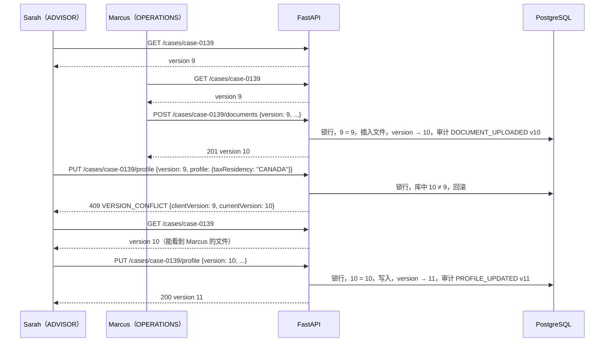

# 06 审计与并发

记录日期：2026-10-06

## 本文依赖

- `apps/web/lib/data/actions.ts`：`mutateCase`、`ConflictError`、`writeLibrary`，以及每个函数写的审计
- `apps/web/lib/types.ts`：`AuditEvent`、`AuditAction`、`AuditChange`
- `apps/web/lib/data/seed.ts`：审计样例 `a-1`…`a-14`
- `docs/production-readiness.md`：「Audit and operations」
- `docs/business-flow-and-ai.md`：「AI 接入原则」里审计要记什么
- `docs/backend/02-postgres-schema.md`：`audit_events`、`cases.version`、`rule_library_state.version`
- `docs/backend/03-api-contract.md`：每个端点的审计 `summary`

## Agent 实现时禁止

- 不跳过 `version` 比较，也不提供「强制覆盖」参数。
- 不在版本比较之外再做「合并」：版本不一致就整次失败。
- 不分多次提交一次写入（例如先改股权、提交、再写审计）。业务数据和审计在同一事务。
- 不更新、不删除任何审计行；不给审计表加 `ON DELETE CASCADE`。
- 不用新的审计动作名。只用 `AuditAction` 的 11 个值。
- 不信任客户端传来的 `actorId`、`at`、`version`、`ai.ruleVersion`。

---

## 1. 乐观锁

### 1.1 规则

- 案件写入请求带 `version`（客户端最后看到的 `CaseRecord.version`）；规则库写入请求带 `version`（`RuleLibraryResponse.version`）。
- 服务端在事务里锁住行后比较：相等则写入并 `version + 1`；不等则回滚并返回 409 `VERSION_CONFLICT`。
- 一次请求要么全部生效，要么全部不生效。不存在「股权改了、审计没写」或「三个文件里登记了两个」的中间状态。
- 成功响应里带新的 `version`，前端下一次写入用它。

这与 `actions.ts` 的 `mutateCase` 语义相同：`if (current.version !== baseVersion) throw new ConflictError()`，然后 `version: current.version + 1`。

### 1.2 事务模板

`fcc_api.services.case_write` 提供一个公共流程，所有案件写入都走它：

```python
from fcc_api.services.case_write import case_write

with case_write(session, actor=actor, case_id=case_id, client_version=body.version, operation="updateProfile") as w:
    # w.case 是已加锁的 cases 行；可见范围、角色、状态锁、版本已检查通过
    w.case.province = body.profile.province
    ...
    w.audit(action="PROFILE_UPDATED", summary=..., changes=[...], before=..., after=...)
# 退出 with 时：version + 1、updated_at = now、插入审计、提交；任何异常都回滚
```

内部步骤：

1. `BEGIN`；`SET LOCAL lock_timeout = '5s'`。
2. `SELECT ... FROM cases WHERE id = :id FOR UPDATE`。没有行或不可见 → 404。
3. 角色与状态锁 → 403。
4. `cases.version != client_version` → 409。
5. 执行业务修改（子表增删改）。
6. `UPDATE cases SET version = version + 1, updated_at = now() WHERE id = :id`。
7. `INSERT INTO audit_events (...)`，`version` 取新版本。
8. `COMMIT`。

等锁超过 `lock_timeout` 也按 409 返回，`details.reason = "LOCK_TIMEOUT"`，提示语同版本冲突。客户端处理方式一样：重新读取再提交。

隔离级别用 PostgreSQL 默认的 READ COMMITTED。行锁保证同一案件的写入串行，门禁和校验读到的是加锁后的最新数据。

规则库写入同理，锁的是 `rule_library_state WHERE id = 1`。

### 1.3 哪些操作改版本

| 操作 | 改 `cases.version` | 写审计 |
| --- | --- | --- |
| 13 个案件写入端点（不含 `createCase`） | 是 | 是 |
| `recordAiRejection`（数据不变） | 是 | 是 |
| `createCase` | 新建为 1 | 是 |
| 申请上传地址 | 否 | 否 |
| 抽取状态变化、扫描状态变化 | 否 | 否 |
| 7 个规则库写入 | 改 `rule_library_state.version`，不改任何案件 | 是 |
| `startRuleDraft` 在已有草稿时 | 否 | 否 |

抽取不改版本的理由见 `docs/backend/05-documents-and-files.md` 5.2 节。

### 1.4 前端的连续写入

前端有一处连续两次写入：解析设立文件确认后，先 `applyAiParties`，再 `uploadDocuments(updated, "formation", files)`，第二次用第一次返回的记录。接后端后，第二次必须带第一次响应里的新 `version`。如果两次之间别人改了案件，第二次会 409，此时股权已经写入，文件没登记，页面应提示重试上传。这与前端现状一致（两次 `run` 各自独立）。

---

## 2. 两个并发保存的时序例子

### 2.1 先后提交：后到的一方被拒

种子案件 `case-0139`，当前 `version = 9`。顾问 Sarah（`u-advisor`）在账户详情页改税务身份；运营 Marcus（`u-ops`）在文件页给 `margin` 上传了一个新文件。两人打开页面时看到的都是 v9。



库的变化：v9 → v10（文件 + 审计 1 条）→ v11（详情 + 审计 1 条）。Sarah 被拒的那次请求没有留下任何行，也没有审计。

### 2.2 同时提交：行锁让它们排队

种子案件 `case-0142`，`version = 4`。顾问 Sarah 在股权图上新增一位董事，同时运营 Marcus 在账户详情页选了省份 `ON`。两个请求几乎同一毫秒到达。

```mermaid
sequenceDiagram
  participant A as Sarah PUT /parties {version: 4}
  participant B as Marcus PUT /profile {version: 4}
  participant DB as PostgreSQL

  A->>DB: BEGIN; SELECT ... FOR UPDATE（拿到锁）
  B->>DB: BEGIN; SELECT ... FOR UPDATE（等待）
  A->>DB: 4 = 4；插入节点；version → 5；审计 OWNERSHIP_UPDATED v5
  A->>DB: COMMIT（释放锁）
  DB-->>B: 返回加锁后的行，version = 5
  B->>DB: 5 ≠ 4；ROLLBACK
  Note over B: 409 VERSION_CONFLICT {clientVersion: 4, currentVersion: 5}
```

库里不会出现两个 v5，也不会出现 Marcus 的省份覆盖了 Sarah 的节点（或反过来）。如果 B 先拿到锁，结果对称：Marcus 成功、Sarah 收到 409。

---

## 3. 审计

### 3.1 只追加

- 每个成功的写入恰好产生约定的审计行（`createCase` 带 AI 建议时两行，其余一行），与业务数据同一事务提交。
- `audit_events` 上有禁止 `UPDATE`、`DELETE`、`TRUNCATE` 的触发器；生产应用账号只有 `INSERT`、`SELECT` 权限。见 `docs/backend/02-postgres-schema.md` 3.14 节。
- 失败的请求（401、403、404、409、400、422）不写审计行，只写结构化日志。
- 导出到 `S3_BUCKET_AUDIT`（本地落在 `{LOCAL_STORAGE_ROOT}/audit/`）按 `docs/backend/12-production-launch.md` 第 7.1 节，经 `audit_outbox` 重试。应用进程不删除 `audit_events`。
- 调查接口 `GET /api/v1/audit/{eventId}/values` 见 12 第 7.2 节，仅 COMPLIANCE 与 ADMIN。列表接口仍不返回 `before_value`、`after_value`。

### 3.2 字段对照

| 要求 | 前端 `AuditEvent` 字段 | 列 | 谁决定 |
| --- | --- | --- | --- |
| 事件 ID | `id` | `id` | 服务端，`evt_<随机>` |
| 操作者 | `actorId` | `actor_id` | 服务端，取身份 |
| 动作 | `action` | `action` | 服务端，按端点固定 |
| 案件 | `caseId` | `case_id` + `scope` | 服务端 |
| 时间 | `at` | `at` | 服务端，事务开始时刻 |
| 案件版本 | `version` | `version` | 服务端，写入后的新版本 |
| 摘要 | `summary` | `summary` | 见 3.3 |
| 字段前后值（展示用） | `changes[]` | `changes` | 见 3.3 |
| 前后值（完整） | 无 | `before_value`、`after_value` | 服务端计算，见 3.4 |
| AI 模型 | `ai.model` | `ai_model` | 客户端传，必须在 `AI_MODEL_ALLOWLIST` |
| 员工是否接受 | `ai.accepted` | `ai_accepted` | 由端点决定：`accept` 为 `true`，`reject` 为 `false`，建案时取 `aiEntityType.accepted` |
| 规则版本（AI） | `ai.ruleVersion` | `ai_rule_version` | 服务端，取案件 `ruleVersion` |
| 规则版本（所有案件事件） | 无 | `rule_version` | 服务端，取案件 `ruleVersion` |
| 关联 ID | 无 | `correlation_id` | 请求头 `X-Correlation-Id`，没有则用 `request_id` |
| 请求 ID | 无 | `request_id` | 服务端 |

接口输出的 `AuditEvent` 保持前端字段，另加两个扩展字段 `ruleVersion`、`correlationId`。`before_value`、`after_value` 本期只入库、不在接口返回（前端没有展示位置），供合规调查时由 DBA 查询。

输出例子（对应种子 `a-2`）：

```json
{
  "id": "a-2",
  "caseId": "case-0139",
  "actorId": "u-advisor",
  "action": "AI_SUGGESTION",
  "summary": "Accepted 4 parties extracted from Shareholder_Register_2026.pdf",
  "at": "2026-10-03T09:57:00.000Z",
  "version": 3,
  "ai": { "model": "doc-extract-demo", "accepted": true, "ruleVersion": "demo-2026-10-04" },
  "ruleVersion": "demo-2026-10-04",
  "correlationId": "seed"
}
```

### 3.3 `summary` 与 `changes` 由谁生成

为了与前端现有文字一致，同时不让客户端随意编造审计内容：

| 动作来源 | `summary` | `changes` |
| --- | --- | --- |
| `updateParties`、`applyAiParties`、`recordAiRejection`、`changeStatus` | 客户端传（这些函数在 `actions.ts` 里本来就由调用方传 `summary`），1–500 字符 | `updateParties` 可传；`changeStatus` 由服务端生成 |
| `updateProfile` | 服务端按 `Updated {change.field 小写}` 生成 | 客户端传的 `change`（展示用标签，如 `Tax residency`、`Canada` → `Mixed`） |
| 其余全部 | 服务端按 `docs/backend/03-api-contract.md` 第 3 节的模板生成 | 服务端生成 |

客户端传入的文字只用于展示。真实的前后值以服务端计算的 `before_value` / `after_value` 为准。

### 3.4 `before_value` / `after_value`

满足 `docs/production-readiness.md`「previous value, next value」。只存被这次写入影响的部分，不存整条案件：

| 动作 | `before_value` | `after_value` |
| --- | --- | --- |
| `CASE_CREATED` | `null` | 案件标量字段 + 根节点 |
| `OWNERSHIP_UPDATED`、`AI_SUGGESTION`（接受） | 被删除和被修改的节点的旧值 | 新增和被修改的节点的新值 |
| `AI_SUGGESTION`（拒绝、建案时的实体类型建议） | `null` | `null` |
| `PROFILE_UPDATED` | 旧 `ProfileDraft` | 新 `ProfileDraft` |
| `CHECKLIST_UPDATED`（设状态） | 该项旧 `ChecklistItemState`（无行时 `{ "status": "MISSING" }`） | 新状态 |
| `CHECKLIST_UPDATED`（挂接文件） | 文件旧 `requirementId` + 目标项旧状态 | 新值 |
| `DOCUMENT_UPLOADED` | 目标项旧状态（无目标为 `null`） | 新文件的 `id`、`sha256`、`sizeBytes`、`mimeType` + 目标项新状态 |
| `REQUIREMENT_ADDED` | `null` | 新 `CustomRequirement` |
| `TASK_UPDATED` | 被切换任务的旧 `done`（新建时 `null`） | 新任务或新 `done` |
| `STATUS_CHANGED` | `{ status }` | `{ status, submittedAt }` |
| `COMPLIANCE_DECISION` | `{ status }` + 被改为 `VERIFIED` 的清单项旧状态 | `{ status }` + 新状态 + 新建任务 id |
| `RULE_LIBRARY` | 草稿或发布指针的相关部分旧值 | 新值 |

这些 JSON 同样属于机密数据，不进日志（见 `docs/backend/05-documents-and-files.md` 第 7 节）。

### 3.5 AI 事件

`docs/business-flow-and-ai.md` 要求「AI 的原始建议、员工是否接受、当时使用的规则版本和模型版本都要进入审计记录」。本期 AI 在前端模拟，后端能记到的是：模型名、是否接受、规则版本、员工确认后的节点（接受时进 `after_value`）。「原始建议全文」要等 AI 调用移到后端后再记，届时在 `after_value` 里加 `suggestion` 字段，不新增动作名。

**前端与后端不一致，已选定后端为准：** `actions.ts` 的 `createCase` 给实体类型建议写的是 `ruleVersion: RULE_VERSION`（常量 `demo-2026-10-04`），而案件钉住的是 `db.ruleLibrary.publishedVersion`。发布过新版本后两者不同，审计会记错版本。后端统一写案件钉住的 `ruleVersion`。

### 3.6 规则库事件

`actions.ts` 的 `writeLibrary` 写 `caseId: "rule-library"`、`version: 1`。后端：

- 存 `scope = 'RULE_LIBRARY'`、`case_id = NULL`、`action = 'RULE_LIBRARY'`。
- `version` 存写入后的 `rule_library_state.version`（不再固定为 1）。
- `rule_version` 存相关的草稿版本号或发布版本号。
- 接口输出时 `caseId` 写成 `"rule-library"`，审计页按 `caseId` 找不到案件时显示「—」，与现状一致。
- 审计查询参数 `caseId=rule-library` 映射到 `scope = 'RULE_LIBRARY'`。
