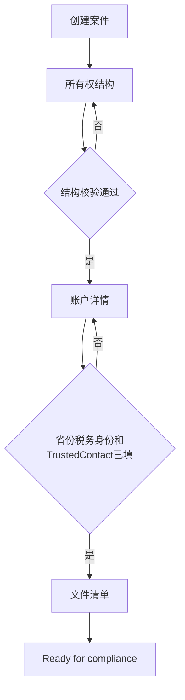

# Complex Account Guide：业务流程与 AI 接入分析

记录日期：2026-10-05

本文根据当前 `complex-account-guide.html`、`packages/domain` 和《Account Opening — Complex Entity Clients》整理，供后续产品与技术讨论使用。

当前规则是演示版。持股合计、受益所有人、FATCA/CRS、PEP/HIO 和 WI/PI 表单选择，上线前需要 Fidelity Compliance 逐条确认。

## 这个工程要解决的业务问题

Fidelity Clearing Canada 的 WI/PI 员工在给复杂实体开户时，需要反复确认股东、控制人、税务身份和对应表格。资料分散在 FINTRAC、CIRO、IRS 清单和内部 checklist 中，漏一项就会在客户签字后被退回。

这个工程把上述工作收成一条可校验的内部案件：

1. 画出“谁拥有、谁控制”的股权树。
2. 记录省份、税务居民身份和账户功能。
3. 由规则引擎生成这份账户实际需要的文件清单。
4. 结构不完整时，阻止进入下一步。

一句话：把“查清单、追股东、补表格”变成一条有门禁、可保存、可审计的开户准备流程。

## 用 IT 语言看业务

一笔开户是一棵树加一组规则。

- 根节点是要开户的实体。
- 子节点是股东、控制人，或者下一层公司、信托。
- 每一层实体都要继续向下拆，直到末端是自然人。
- 规则引擎读取这棵树和账户属性，输出文件清单。

监管上要回答三个问题：

- 谁拥有这家实体。
- 谁能控制或代表这家实体签字。
- 因为税务身份和账户功能，还要交哪些税表、协议和开户文件。

对应的外部规则主要是 FINTRAC、CIRO 3203/3204、FATCA/CRS 和 IRS 预扣税表格。

## 参与角色与系统边界

首期使用者是内部员工，客户门户不在当前范围内。

| 角色 | 在流程中的动作 |
| --- | --- |
| WI/PI Advisor | 建案件、画股权树、填账户详情、收集文件 |
| Operations | 跟进缺件、把案件推进到可送审状态 |
| Compliance | 复核结构与文件，退回补件或接受 |
| Admin | 管规则版本、权限和审计 |

当前工程内已经有案件、股权树、清单和审计模型。尚未接入的公司系统包括 Entra ID、uDirect、uniFide、正式 PDF 表格和名单筛查服务。

## 案件状态

| 状态 | 含义 |
| --- | --- |
| Building | 员工仍在补结构和账户信息 |
| Docs requested | 资料已向客户索取，尚未收齐 |
| Ready for compliance | 清单项已收集，等待合规复核 |

每次保存增加版本号，并记录操作者、时间和前后值。两个人同时修改同一案件时，后保存的一方会收到冲突，避免互相覆盖。

## 主流程

### 第 1 步：所有权结构

1. 选择实体类型并填写法定名称。
2. 系统创建根实体。
3. 对每个实体节点添加“自然人”或“另一层实体”。
4. 自然人记录居住国、是否美国人士、持股比例、是否有签字或决策权、是否为 PEP/HIO。
5. 中间实体记录类型、美国税务分类、是否美国实体和持股比例，然后继续向下拆。

当前原型支持的实体类型：

- Corporation
- Non-Profit / Charity / Foundation
- Formal Trust
- IPP / RCA
- Partnership / LP
- Estate
- Condo Corporation
- Pooled Fund
- Association / Union
- First Nation / Indigenous Government

通过条件：

- 每个实体至少有一个所有者或控制人。
- 已披露的持股合计为 100%。

未通过时，继续按钮保持禁用，并显示具体缺口。

### 第 2 步：账户详情

记录：

- 注册省份或地区。
- 税务居民身份：加拿大、美国、国际、混合。
- 账户功能：保证金、期权、COD/DVP、全额付费借券。
- 是否指定 Trusted Contact。

第 1 步里标记为 PEP/HIO 的人会汇总到这一步。省份、税务身份和 Trusted Contact 都填完，才能生成清单。

### 第 3 步：文件清单

规则引擎按案件数据生成分组清单。员工可以：

- 勾选已收集文件。
- 增加额外要求。
- 查看 required 与 conditional 数量。
- 打印清单。

全部收集后，案件可进入 `Ready for compliance`。

## 两类必须识别的人

持股达到或超过 25% 的人需要 FINTRAC 识别。低于 25% 但拥有签字权或能主导决策的人同样需要识别，例如唯一董事、授权签字人、受托人、执行人。

因此系统同时记录两条线：

- 所有权：持股或权益比例。
- 控制权：能否代表实体做决定或签字。

如果股东本身是公司、信托或其他实体，不能停在这一层，必须继续查找背后的自然人。First Nation 在当前业务说明中按公共机构处理，受益所有人穿透到该治理层为止，这条规则仍待 Compliance 书面确认。

## 规则引擎的输入与输出

演示规则位于 `packages/domain/src/index.ts`，版本号为 `demo-2026-10-04`。

| 输入 | 系统推出的资料 |
| --- | --- |
| 任何实体 | NAAF、设立或治理文件 |
| 公司、Condo、慈善机构、协会、First Nation | 决议或签字授权 |
| 公司、合伙、基金、信托、IPP/RCA | 受益所有人识别 |
| 存在自然人 | 签字人和控制人的身份核验 |
| 某人标记为 PEP/HIO | 加强尽职调查 |
| 选择保证金、期权、COD/DVP、FPL | 对应协议和风险披露 |
| 指定 Trusted Contact | Trusted Contact 表格 |
| 美国税务身份或美国人士 | W-9 |
| 国际税务身份 | W-8 系列 |
| 国际或混合税务身份 | RC519 |

条件项使用 “IF APPLICABLE” 标识。员工补充的自定义要求进入 Additional Requirements。

## AI 接入原则

AI 适合做读取、建议和解释。最终是否满足监管要求，由确定性规则引擎判断。

员工确认后的结果才写入案件。AI 的原始建议、员工是否接受、当时使用的规则版本和模型版本都要进入审计记录。

PEP/HIO、制裁名单和最终税务分类应调用公司已批准的筛查系统，或由 Compliance 决定。AI 可以提示“需要筛查”，不能自行宣布某人不是 PEP，也不能自行决定 FATCA 分类。

## 建议接入 AI 的位置

按业务价值和实施风险排序。

### 1. 设立文件解析

上传公司章程、股东名册、信托协议或合伙协议后，AI 提取名称、股东、比例、董事和签字人，生成待确认的股权树。

页面对应入口是 `Parse Formation Documents`。员工必须逐项确认后才能保存。

### 2. 实体类型判断

业务指南有专门场景：员工不知道该选哪个 Manual Account Opening subtype。AI 可根据注册信息和文件，建议公司、信托、合伙、慈善机构等子类型，并说明依据。

### 3. 对话填表

Assistant 读取当前案件，把员工的一段描述转成节点和字段。例如：“Alice 持有 60% 并担任董事。”系统展示将要写入的字段，确认后再落库。

### 4. 缺漏解释

当继续按钮被禁用时，用业务语言说明缺的是控制人、持股未满 100%，还是某一层公司没有拆到自然人，并指出应该点击哪个节点。

### 5. 清单差异复核

对照已上传文件和规则清单，指出缺页、名称不一致、签字人与树上的人不匹配。这对应 FCC 现有的 Compliance pre-review：在客户签字前先发现缺口。

### 6. 表格回填

用已确认的案件数据填充 NAAF、Resolution 和受益所有人表，并标出无法自动填写的空项。正式表格模板和字段映射需要业务部门提供。

### 7. 合规意见转任务

把 Compliance 退回意见拆成可跟踪的补件任务，关联到具体节点、字段或清单项。

## 后续讨论方向

- 把股权树作为正式领域模型，支持多层公司和信托交叉持有。
- 给每条清单规则绑定来源、生效日期、审核人和测试用例。
- 已生成清单的案件保留当时的规则版本，不因新规则自动改写历史结果。
- 先做内部 pre-review，再考虑客户门户和在线上传。
- OCR、名单筛查、uDirect 和 PDF 回填分别作为可替换适配器，不写进核心规则。
