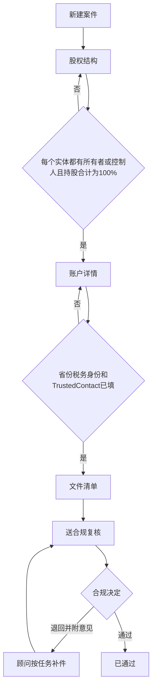

# Complex Account Workbench：页面使用流程与设计说明

记录日期：2026-10-05

本文说明当前 `apps/web` 里这套内部工作台怎么用、为什么这样设计，以及它对应加拿大复杂实体开户的哪一段。业务规则来源见 [业务流程与 AI 接入分析](business-flow-and-ai.md)。

当前是可点击的前端演示。案件存在浏览器本地，刷新后还在；左下角用户卡片里可以「Reset demo data」恢复示例案件。AI 是模拟的，只用来确认交互。规则版本 `demo-2026-10-04` 仍待 Fidelity Compliance 逐条书面确认，不能当作已批准的开户依据。

打开地址：`http://localhost:3000`。

## 设计理念

这套界面是给内部员工用的开户案件工作台，不是 CRM。CRM 管客户关系和销售进度；这里管的是一笔复杂实体开户能不能被合规接受。

四个决定界面形状的原则：

1. **一个案件里做完所有事。** 股权、账户属性、文件和复核是同一案件的四个步骤，员工不离开案件去别的系统拼材料。
2. **股权用图，不用长表单。** 多层公司、信托和控制人放在同一张图上。点开节点就地改，不用反复开大弹窗。
3. **不完整就走不下去。** 结构没画完，账户详情进不去；省份、税务身份和 Trusted Contact 没填完，文件清单不生成；清单没收齐，不能送审。缺口显示在图上和右侧，而不是等客户签完字再被退回。
4. **AI 只建议，规则引擎判定，员工确认后才落库。** 是否需要某份文件，由确定性规则算出来。AI 可以读文件、猜实体类型、把一句话转成节点，但员工逐项确认后才写入。PEP、制裁和税务分类不能由 AI 宣布结论。

视觉上沿用参考图的浅色工作台：白色分组侧栏、浅灰蓝背景、圆角卡片、蓝色主按钮、点阵画布。风险用颜色区分：黄色是结构缺口，红色是 PEP，绿色是已完成，紫色是 AI 建议。

每个案件页是同一套骨架：

- 顶栏是案件身份和当前能做的动作。
- 步骤条显示四步的完成、卡住和锁定状态。
- 中间是当前工作面。
- 右侧是上下文：校验结果、为什么需要这份文件、AI 建议。

全局导航在左侧，按「案件管理 / 工具 / 管理」分组。顶栏搜索（⌘K）按法定名称、案件编号或人名跳到案件或具体节点。

## 加拿大复杂实体开户，系统管的是哪一段

Fidelity Clearing Canada 的 WI/PI 员工给公司、信托、合伙、慈善机构这类实体开户时，不能只收一张申请表。监管要先回答三个问题，答完才知道还要哪些文件。

| 监管要回答的问题 | 主要依据 | 在系统里的位置 |
| --- | --- | --- |
| 谁拥有这家实体 | FINTRAC 受益所有人；有效持股达到或超过 25% 的自然人要识别 | 第 1 步股权图，标成 Identify |
| 谁能控制或代表它签字 | 低于 25% 但能决策或签字的人同样要识别，例如唯一董事、受托人、授权签字人、执行人 | 同一张图上的控制 / 签字虚线 |
| 因为税务身份和账户功能，还要交什么 | CIRO 3203/3204、FATCA/CRS、IRS 预扣税表，以及保证金、期权等协议 | 第 2 步账户详情驱动第 3 步文件清单 |

如果股东本身是公司或信托，不能停在这一层，必须继续拆到自然人。示例案件 Maple Ridge Holdings 就是这样：Harbourview Capital 持有 35%，其背后的 Raj Patel 有效持股 24.5%，Mei Lin 有效持股 10.5%。系统按穿透后的比例判断谁需要识别，而不是只看直接持股。

这套系统覆盖的是**客户签字之前的内部准备**（FCC 现有的 Compliance pre-review）：把结构画完整、把该要的文件列出来、在送审前发现缺口。客户门户、公司注册库查询、正式名单筛查、PDF 回填和 uDirect / uniFide 都不在当前范围内。

## 角色

左下角可以切换演示用户，界面按角色收动作。

| 角色 | 日常怎么用 |
| --- | --- |
| WI/PI Advisor | 建案件、画股权、填账户详情、向客户要文件、送审 |
| Operations | 跟进缺件、上传收到的文件、把状态推进到可送审；可以把清单项标成已核验 |
| Compliance | 在合规队列里通过或退回；退回时每条意见变成一条任务 |
| Admin | 看规则版本和全量审计；演示里权限与运营接近 |

合规用户看不到「新建案件」。案件处于「待合规」时，顾问不能再改结构和清单，避免复核过程中材料被改掉。

## 一条案件怎么走完

状态含义：

| 状态 | 含义 | 谁来推 |
| --- | --- | --- |
| Building | 还在补结构和账户信息 | 顾问 |
| Docs requested | 已向客户要资料，还没收齐 | 顾问或运营 |
| Ready for compliance | 清单已收齐，等待复核 | 顾问送出，合规处理 |
| Returned | 合规退回，带未完成任务 | 合规退回，顾问补 |
| Approved | 复核通过，不再编辑 | 合规 |

每次保存版本号加一，并记下操作者、时间和前后值。演示里后一次保存会覆盖本地数据；接上后端后，两个人同时改同一案件，后保存的一方会收到冲突提示。

## 页面使用流程

### 1. 仪表盘 `/`

登录后的第一屏，用来在十几秒内看出今天该处理哪一笔。

- 顶部四张数字：未结案件、卡在结构上的、正在收文件的、已送合规的。
- 「Needs attention」按到期日排序。每一行直接写卡在哪一步，以及具体原因，例如「持股合计不是 100%」「还没选注册省份」「还缺 7 份文件」。
- 右侧是案件状态分布，以及未结案件卡在四步中的哪一步。
- 下方是全库最近操作，以及合规退回后还没做完的任务。

黄色提示条说明当前规则是演示版，并链到规则库。

### 2. 案件列表 `/cases`

所有案件的工作队列。

- 用状态芯片筛选：全部、分配给我、Building、Docs requested、Ready for compliance、Returned、Approved。
- 可按实体类型过滤，或按法定名称、案件编号、注册号搜索。
- 每行显示：实体、状态、卡在哪一步、文件进度、负责人、到期日、最近更新和版本号。
- 点一行进入该案件当前应处理的股权页。

逾期用红色，两天内到期用琥珀色。

### 3. 新建案件 `/cases/new`

顾问（以及运营）从这里开一笔新案。

1. 选择起步方式。
   - **From formation documents**：建完后直接打开「解析设立文件」，适合客户已经给了章程、股东名册或信托协议。
   - **Enter manually**：建完后自己在图上逐个加节点。
2. 填写法定名称、客户对这家实体的描述、注册地和注册号。描述是选填，用来帮助判断实体类型。
3. 选择 Manual Account Opening 子类型。点「Suggest with AI」后，系统根据名称和描述给出一个子类型、置信度和理由。员工可以采纳，也可以改选。这个选择决定后面要哪些文件，例如公司需要决议，信托需要受益所有人识别。
4. 指定案件负责人，默认 10 天后到期。

创建后生成根实体，状态为 Building，并写一条「案件已创建」的审计。如果用过 AI 建议，审计里会记下模型、员工是否采纳，以及当时的规则版本。

### 4. 股权结构 `/cases/{id}`

案件的第一工作面，也是这套产品的中心。

图上的读法：

- 蓝色卡片是要开户的实体。
- 灰色实线是持股，例如 `Owns 40% · Director`。
- 粉色虚线是没有持股、但有控制或签字权，例如董事、授权签字人。
- 紫色虚线是既持股又控制。
- 红色脉冲是被标成 PEP/HIO 的人。
- 蓝色 Identify 标签表示这个自然人要做身份核验：有效持股达到或超过 25%，或者有控制权、签字权。
- 节点上的 Effective 是穿透后的持股。直接持股和有效持股不一样时才会显示。
- 黄色顶条表示这个实体还没拆完，或它下面的持股合计不是 100%。

员工可以：

- 拖动画布、缩放，或点 Auto layout 恢复自动排布。
- 点节点，在右侧改名称、角色、持股、居住国，以及控制人、签字权、美国人士、PEP/HIO。PEP 这里只是标记，不能在这里宣布「已排除」。
- 点节点上的加号，或「Add under …」，在该实体下加一个自然人或下一层实体。加的是实体时，页面会提示还必须继续往下拆。
- 删除一个节点。如果下面还有持有人，会连同下层一起删，并先确认。

右侧在没选中节点时显示结构检查：

- 通过时是绿色说明，并给出「继续到账户详情」。
- 未通过时，每条缺口用业务语言写清缺什么、该点哪个节点。点这条缺口，图会定位到那个节点。
- 「Persons to identify」列出当前必须识别的人，以及触发原因（有效持股、控制人或签字人）。

「Parse formation documents」用于上传章程、股东名册、信托协议或合伙协议：

1. 选择文件，或在演示里使用示例文件。
2. 系统读出名称、角色、持股和出处页码，并给出置信度。
3. 低置信度的行默认不勾。员工可以改名称、角色、比例，或取消某一行。
4. 选择挂到哪一层实体，确认后才写入图。文件同时挂到「设立文件」这项清单上。
5. 放弃建议也会记审计：模型、拒绝、规则版本。

顶栏「Ask AI」打开只读当前案件的助手，例如：

- 「Why can't I continue?」按缺口说明缺控制人、持股不满 100%，还是某一层公司没拆到自然人。
- 「Which documents are still outstanding?」列出未收齐的文件和原因。
- 「Jane Doe owns 10% and is a director」解析成一张待确认的字段卡：挂在哪一层、比例、是否控制人、是否签字人。点 Apply 才写入；如果加上去之后持股会超过 100%，会先提示。

### 5. 账户详情 `/cases/{id}/details`

股权校验通过后这一步才可编辑。未通过时页面只说明还缺什么，并送回股权图。

五个小节，改完即保存：

1. **注册省份或地区。** 加拿大 13 个省和地区。
2. **税务居民身份。** 加拿大、美国、国际、混合。国际会带出 W-8 和 RC519，美国或结构里有美国人士会带出 W-9，混合会带出 RC519。
3. **账户功能。** 保证金、期权、COD/DVP、全额付费借券。每一项对应自己的协议和风险披露，不选就不出现在清单里。
4. **Trusted Contact。** 必须明确选「已指定」或「客户拒绝」。指定时要填写姓名，并因此增加 Trusted Contact 表格。
5. **从股权带过来的标记。** PEP/HIO 和美国人士在这里只展示，修改要回到图上的那个人。

右侧实时预览：按当前答案，规则引擎将要求哪些文件、分在哪一组。三项门禁（省份、税务身份、Trusted Contact）都满足后，「Generate document checklist」才可点。

### 6. 文件清单 `/cases/{id}/documents`

结构校验和账户详情都通过后，规则引擎按当时的规则版本生成清单。之后即使规则库更新，这张清单仍钉在生成时的版本上。

清单分组：

- Entity Formation & Authorization：NAAF、设立或治理文件、决议或签字授权、受益所有人识别、Trusted Contact。
- Persons to Identify：签字人和控制人的身份核验；有 PEP 时增加加强尽职调查。
- Account Features：保证金、期权、COD/DVP、全额付费借券中实际选中的协议。
- IRS / Withholding Tax 与 FATCA / CRS：W-9、W-8、RC519 中实际触发的表格。
- Additional Requirements：员工自己加的额外要求。

每一行可以：

- 看为什么需要它：规则编号、来源（FCC guide、FINTRAC、CIRO、IRS）、触发它的具体的人。点人名回到股权图上的该节点。
- 标状态：Missing、Requested、Received。运营、合规和管理员还可以标 Verified 或 Rejected。
- 上传 PDF 或图片。上传后挂到这一行，状态变为 Received。
- 条件项带「If applicable」。这是规则给出的条件，不是员工可以随意删掉的可选项。

右侧：

- **AI pre-review** 对照已上传文件和清单、股权图，指出缺页、签字人姓名和树上的人不一致、该识别的人还没有身份文件、PEP 还没有筛查结果。发现可以一键变成跟进任务。AI 不能把某人标成「不是 PEP」。
- **未归属文件** 是上传了但还没挂到清单项的文件，可以在这里指定挂到哪一项。
- **最近上传** 显示谁在什么时候传的。

顶部可打印清单，或增加一条额外要求。

当清单全部为 Received 或 Verified，且没有未完成任务时，顶栏「Submit for compliance」才可点。结构已完整但文件未齐时，可以先标成 Docs requested，表示已向客户索取。

### 7. 合规复核 `/cases/{id}/review`

这一步记录人的决定和全部历史。

- **Follow-up tasks**：合规退回意见和 AI 预审发现。每条可以关联到某个节点或某份文件，完成后打勾。
- **Case history**：谁在什么时间做了什么，产生了哪个版本。改过的字段显示改前、改后。AI 相关记录额外显示模型、员工接受还是拒绝、规则版本。
- **Readiness**：结构、账户详情、清单、未完成任务四项是否都过。
- **Case record**：编号、版本、规则版本、负责人。这里写明清单钉在该规则版本上。

合规用户打开状态为 Ready for compliance 的案件时，顶部出现决定条：

- **Approve**：已收到的文件标为 Verified，案件关闭编辑。
- **Return with comments**：每条意见写成任务，可挂到具体的人或文件上，案件变为 Returned。顾问回到案件后，步骤和任务会指出要补哪里。

顾问在这个状态下看到的是「案件在合规手中，当前只读」。

### 8. 合规队列 `/compliance`

给合规看的收件箱，不按顾问的工作队列混在一起。

三列：Awaiting review、Returned、Approved。等待复核的按提交时间从早到晚排，避免新案件插到旧案件前面。每行给出要识别的人数、是否含 PEP、文件数、未完成任务、负责顾问和等待时长。点 Review 直接进该案件的复核页。

### 9. 实体与人员 `/entities`

把所有案件里出现过的人、公司、信托摊平，用来发现同一个人出现在多笔结构里。

可以按自然人、实体、PEP/HIO、美国人士过滤。每行给出角色、直接持股、有效持股、Identify / Controller / Signer 标记，以及所在案件。点名字进入那一笔案件并定位到该节点。

### 10. Document AI `/document-ai`

跨案件的文件台账，不是另一个产品。

上半部分说明六种 AI 能力各自出现在哪一页：解析设立文件、建议实体子类型、对话填表、缺漏解释、清单预审、合规意见转任务。下半部分列出全部已上传文件、挂到了哪项清单、是否已抽取、谁上传的。可筛出正在读取的，和还没挂到清单项的。

### 11. 规则库 `/rules`

给管理员和合规看「系统为什么要这份文件」，不是给顾问日常操作的。

- 当前版本号、状态（草稿，待合规签署）、有多少案件钉在这个版本上。
- 每条规则一行：触发条件、来源、签署状态。演示数据里签署状态都是 Pending。
- 右侧规则测试器：换实体类型、税务身份、账户功能、Trusted Contact、是否有美国人士或 PEP，立即看到会生成哪些文件。用来在改规则前看影响，不写进任何案件。

### 12. 审计日志 `/audit`

全库、只追加的操作记录。可按动作、案件、人员过滤。展开一行可以看到字段前后值；若是 AI 建议，还能看到模型、员工决定和规则版本。

从案件复核页看到的是这一笔的历史，从这里看到的是所有案件。

## 从哪些方面提高业务人员的效率

对照现在的工作方式：资料散在 FINTRAC、CIRO、IRS 清单和内部 checklist 里，股东要一层层追，漏一项就要等客户签完字再退回重来。

| 现在耗时间的地方 | 页面上怎么收 | 省下来的是什么 |
| --- | --- | --- |
| 打开案件后要翻备注才知道卡在哪 | 仪表盘和列表直接写卡在股权、税务还是文件，并给出那一句缺口 | 分拣队列的时间。目标是 10 秒内判断先做哪一笔 |
| 股东、董事、下一层公司记在表格和邮件里，对不齐 | 一张图同时表达持股和控制权，穿透后的有效持股自动算 | 少来回对 Excel，少漏掉「公司后面还有公司」 |
| 不确定 25% 以下的董事要不要识别 | Identify 由规则打在人身上：达到 25%，或虽不到 25% 但能控制、能签字 | 少查一次 FINTRAC 说明，也少把不该漏的控制人漏掉 |
| 不知道该选哪个 Manual Account Opening 子类型 | 新建案件时 AI 给出子类型和理由，员工确认 | 少在指南里翻场景说明；选错类型会直接导致清单错，这一步把选择露在前面 |
| 章程、股东名册要手工敲进表 | 解析设立文件，抽出的人带出处和置信度，确认后入图 | 少打字；低置信度默认不勾，减少将错就错 |
| 客户口头说「某某人持股并担任董事」，再手工填很多格 | 助手把这一句变成待确认字段卡 | 录入从「找对字段」变成「核对一句」 |
| 继续按钮是灰的，但不知道为什么 | 右侧用业务语言说明缺控制人、持股不满 100%，还是哪一层没拆到自然人，并定位到节点 | 少问同事，少在图上自己找 |
| 每笔开户重新对照多份监管清单 | 清单由实体类型、省份、税务身份、账户功能、PEP、美国人士和 Trusted Contact 生成 | 只看到这份账户真正要的文件，而不是整本指南 |
| 客户问「为什么要这份」时要再查来源 | 每一项可展开规则编号、来源和触发它的人 | 对客户和合规的解释直接来自同一条规则 |
| 文件收到了，但没人知道它对应清单的哪一行 | 上传即挂到该行；没挂上的集中在「未归属文件」 | 少出现「文件在邮箱里、清单上仍是缺」 |
| 合规预审靠人工对姓名、缺页、签字人 | 预审先标出姓名不一致、缺页、该识别的人没有身份文件、PEP 没有筛查结果，并可变成任务 | 合规把时间花在真要判断的案件上，而不是先做对照 |
| 退回意见写在邮件里，补的时候对不上人或文件 | 退回的每条意见是一条任务，挂到节点或清单项，完成打勾 | 补件有清单，不会漏掉其中一条 |
| 两人同时改、或事后说不清谁改了持股 | 版本号、前后值、操作者、时间；AI 建议另记模型和是否采纳 | 争议时可以回放，而不是对两份表格 |

效率来自少返工，不来自跳过核验。送审按钮在结构、账户详情、清单和未完成任务都过之前是关着的，就是为了把退回从「客户签字之后」挪到「送审之前」。

## 使用时要注意的边界

- 规则是演示版。持股合计、受益所有人门槛、FATCA/CRS、PEP/HIO、First Nation 穿透到治理层为止，都还要 Compliance 书面确认。规则库页面上每一条都标着 Pending。
- AI 不决定监管结论。它不宣布某人不是 PEP，不决定 FATCA 分类，也不替换名单筛查。正式筛查仍走公司已批准的系统，结果作为文件挂回清单。
- 现在没有后端。数据在这台浏览器里，换浏览器或清除站点数据会丢失。上传的文件只记录文件名和大小，不保存文件本身。
- 客户不能登录这套界面。收集仍由员工向客户索取，再把收到的文件登记进来。
